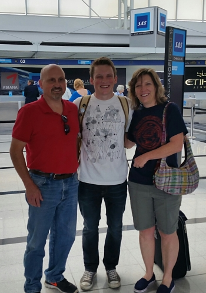
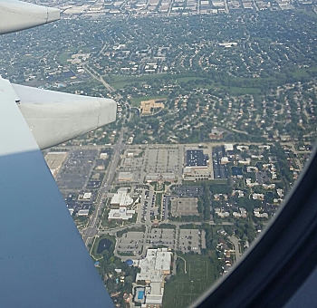
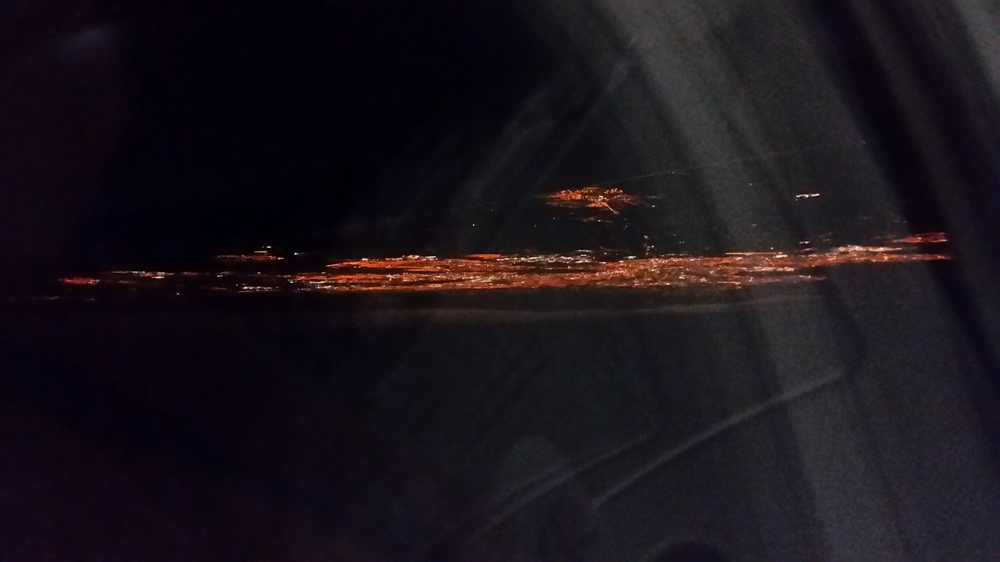
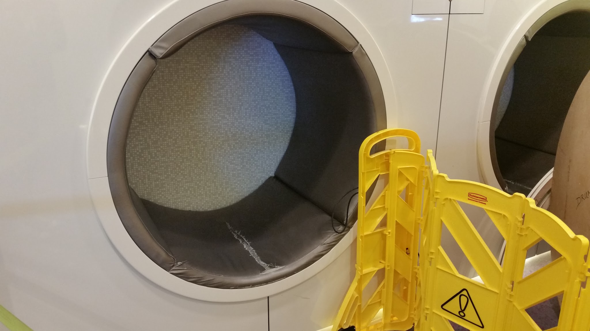

# The beginning

_Sep 2, 2015_

My four month long journey started in O'Hare where I hugged my parents goodbye and made my way through security.  
  

  
My flight left at 3:50 P.M. Central Time and was about 7 hours to Dublin International Airport.  I was super excited that we flew over Elk Grove and I got to see my house! Even if that meant I was that annoying airplane that interrupted someones conversation down on the ground in Elk Grove.  
  

  
The plane ride went flawlessly and I arrived here at 5:00 A.M local time. The city looked beautiful at night.  
  
  

  
The airport was pretty dead when I arrived and I decided to catch up on some sleep in this cool looking cubby hole.  
  

After a couple hours, I woke up to a bustling atmosphere.  I'm getting pretty excited for this trip after spent my first Euros on coffee ( thanks Aunt Kathy!! ), and hearing many different languages around the airport. Already, I can see cultural differences. I saw a store in the airport dedicated to rugby,  different snack food and candies, and in the way people dress.  
  
 I'm excited, but slightly nervous for this incredible immersion opportunity. I will be posting later this week after I arrive and settle in in Bilbao!