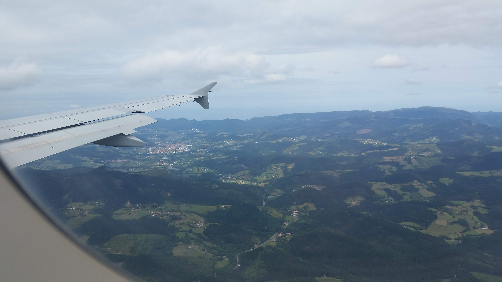
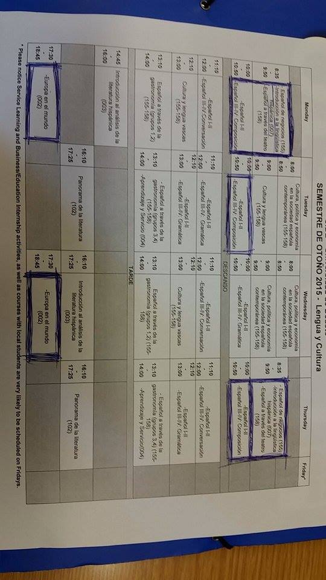
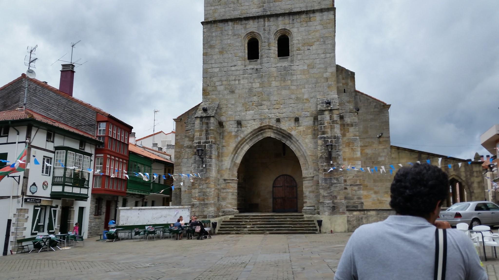
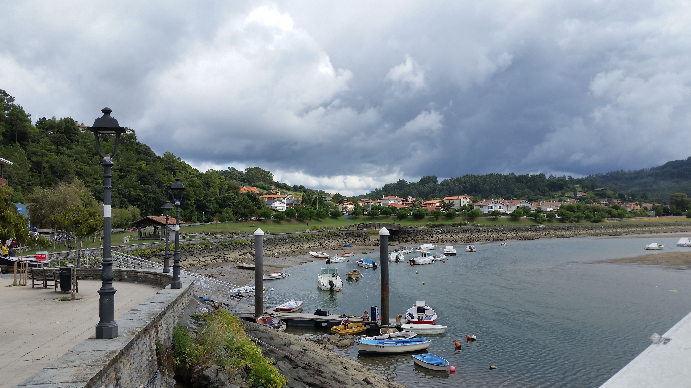
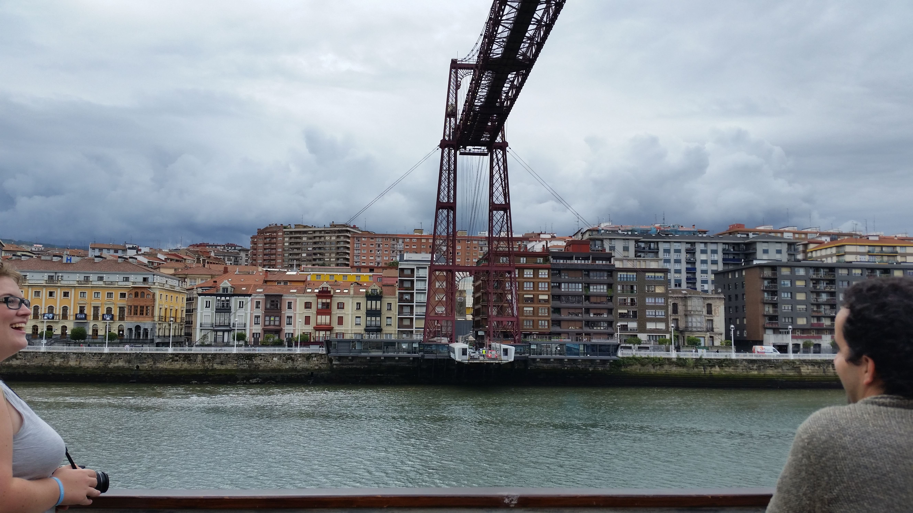
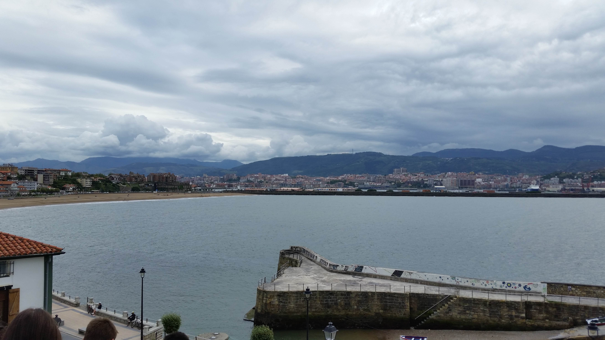
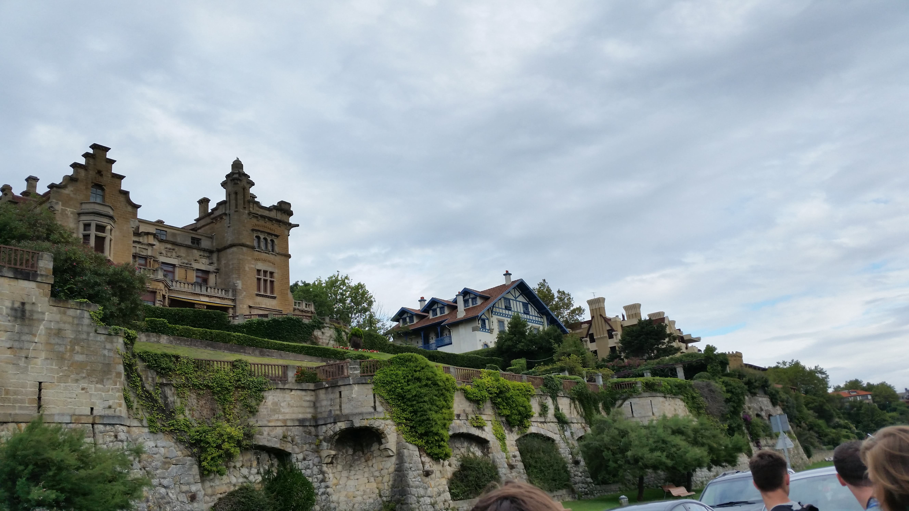

# The First Couple Days

_Sep 7, 2015_

  
So I successfully arrived in Bilbao and all is well! A lot has happened, and I will try to cover as much as possible!  
  

  

After I arrived in the airport, I was picked up by my host mom and taken to her apartment.  She is a widow in her early sixties. She lives alone in a two bedroom two bathroom apartment in Algorta which is an area outside of Bilbao. Its about 30 minutes away by metro.  I have my own room and my own bathroom which is really nice, and from talking to the other students, it seems like a rarity.  I don't have any pictures of the apartment, but I will share those later.

  

  

  

  

  

  

So the next day, we went to the school and had an arrival presentation.  This covered things we should know about the city and the program and such.

  

  

  

After that, we all took a one hour placement test.  This was a little nerve racking because I needed to place into the 300 level in order to take the classes that I wanted.

  

  

While we are on the subject of classes, I can show you my schedule for this semester.  I will  be taking 13 credit hours.  So yah my schedule is reallyyy spread out.  Also, NO CLASS ON FRIDAY!!! That's never gunna happen again in my life!  All of the classes I will be taken will be exclusively taught in Spanish.  I will be taking a composition class, a linguistics class, a history class, and also a business internship class.  The internship will be at a company called RV Cooling. It is a Spanish company that makes industrial refrigerators.

  

Schedule!!

  
  
  
  

Later that day we were taken on a tour of the old town. We were shown quite a few different types of old Basque architecture and also explained the history of the town of Bilbao.  So I'll give you a quick crash course. First, Bilbao was a port city and a big hub of trading and commerce.  Then it became an industry hub.  It was one of the largest producers of steel in the world.  Lastly it transitioned to a more service based town. It has many companies in the tech industry.  One tour guide described it as a mini Silicon Valley.  There is also a lot of money in the tourist business because of the beautiful coast line and great fishing.  Bilbao is a part of the Basque region which is an area of Spain in the north.  The people here speak Basque, but also speak Spanish.  The region was very oppressed during the dictatorship under Franko, and many of the people are still very bitter about it.  Many would like to have independence from Spain.  In fact, one of my friends was confronted by someone who was upset that he was supporting the "enemy" by wearing a red and yellow Spanish jacket with the Spanish flag.  So yes, some people are pretty vocal about it.

Basque Flag

  

So lets talk about out tour now! First we went to the outskirts of the Bilbao area and saw the town of Plencia.  This was a fishing town way back in the Middle Ages, but it now it is very touristy. First we ate lunch at a country club that had a pool, tennis courts, and a jai alai court. When we were eating, I asked the tour guide (and later I found out he is the professor of two of my classes) about the jai alai court and if it was a popular game here.  He told me that jai alai was actually started in Basque country, so yes it is a popular sport here.  

  

In this picture you can see the traditional architecture of the houses and the church that is in the middle. We were told that these houses were owned by the rich.  They had built a wall around these houses and would use the church as a keep during attacks from the pirates.  Notice in the bottom left corner, the Basque flag that many people proudly fly.

  

  

  

Here you can see the river that runs through Plencia.  This river is actually an estuary, which means that it is like a river, except that it is connected to the ocean and its water levels vary with the tides.  

  
  

  

Next we went closer to the city and we saw one of the most ridiculous inventions I've ever seen.  So like I said, Bilbao is a port city, and so there are many large ships that come through.  The river is very wide and so drawbridges work, but they are slow and can get in the way of ships.  So they built this thing.  Its basically a hanging ferry boat.  The structure is tall enough so that large boats can go under, but cars can still get across by using the ferry.  Pedestrians can take elevators up and walk across the top of the bridge as well. There are only four still in existence and one of them is here in Bilbao.  
  

<video src="../public/images/20150903-164510.mp4" controls width="100%"></video>

  
  
  
  
  
Here is a video of the ferry going accross. I'm not sure if the video will work though.  
  
  
  
  
  
  
  
  
  
  
  
  
  
  
  
  
  
  
  
At the end of our trip we went outside of the city a little bit. We were able to see the beach that was by my house.  This picture also gives a good view of the actual city of Bilbao  
  
  
  
  

  
  
  
  
  
Here are some of the houses that are really close to that beach.  They're pretty enormous for the area.  
  
  
  
  
  
  
  
That last stop was the end of our tour and after that I went home and had some dinner with my host mom!  This post was very long winded and I don't think that the rest of them will be nearly as long or have nearly as many pictures as this one.  All is well with me right now and I am having a great time and learning a lot.  Already I can tell that I am improving with my Spanish.  I'm able to recognize my mistakes with tenses things like that.  Stay tuned for the next post about our tour of the inner city of Bilbao!  
  
  
  
  
  
  
  
  
  
