# A Tour of the Apartment

_Sep 9, 2015_

I will now show you my humble abode!  This is where I will be living for the next 4 months.  It is about a 5 minute walk from the metro and then school is about a 30 minute ride away.  Its kinda far, but so far it has been manageable.  My apartment complex is right next to a pretty popular square. There are a lot of restaurants, stores and bars around it. There are people on the square all day until everything closes at about 12 A.M. There are also quite a few events that happen there too.  There was an art festival where they set up a screen and projected art for a few hours. Another day, there was also an opera singer there for a couple hours. Its a pretty busy place! Also, one random thing; if the pictures are too small, you can click them and make them bigger (:

  

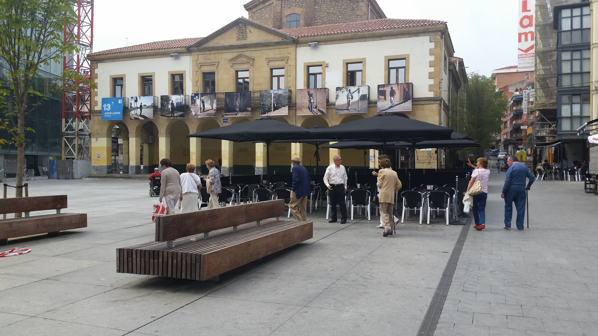

The plaza near my house

Anyways, lets get on with the tour!  So this is what you would see walking up to my door! My building is on the brick one on the left.  The construction is right out my window and can be kind of loud sometimes. 

  

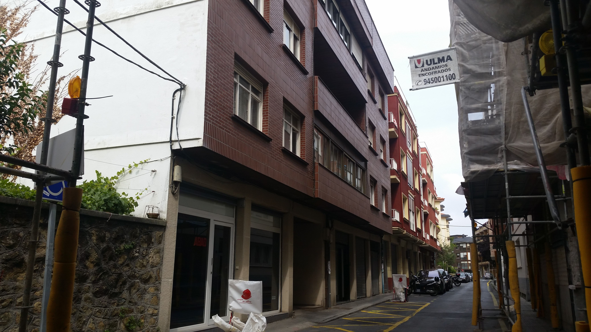

  

  

I live on the "3rd floor" of my apartment building.  Fun Fact: In a lot of Europe, they don't start with 1 as the first floor, its 0. So I actually live on the second floor!

  

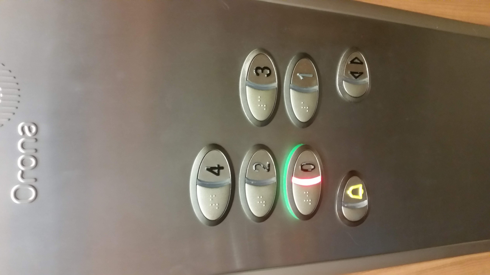

  

  

So this is what you see when you first walk in the door.  On the left is the salon/parlor room. and then at the end the hall way takes a right and leads to the rest of the house.

  

  

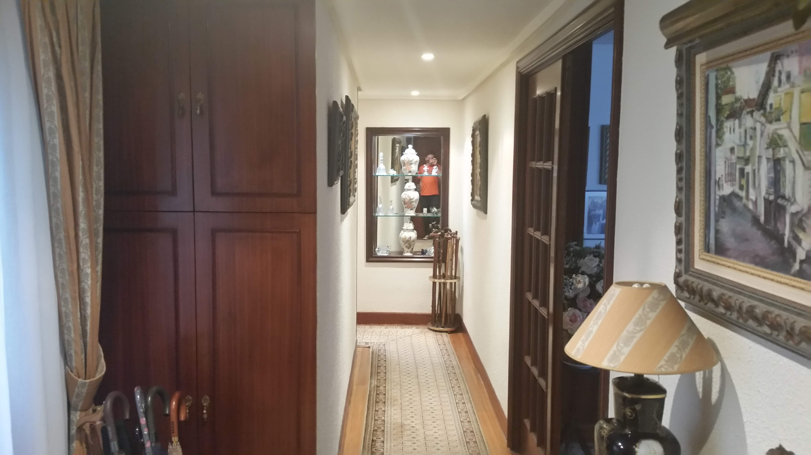

Notice the UIUC T-shirt in the mirror?

  
  

  

 Here is the parlor.  Notice on the left there are two guitars.  My host mom is a classical guitar teacher, so maybe I'll learn some this semester!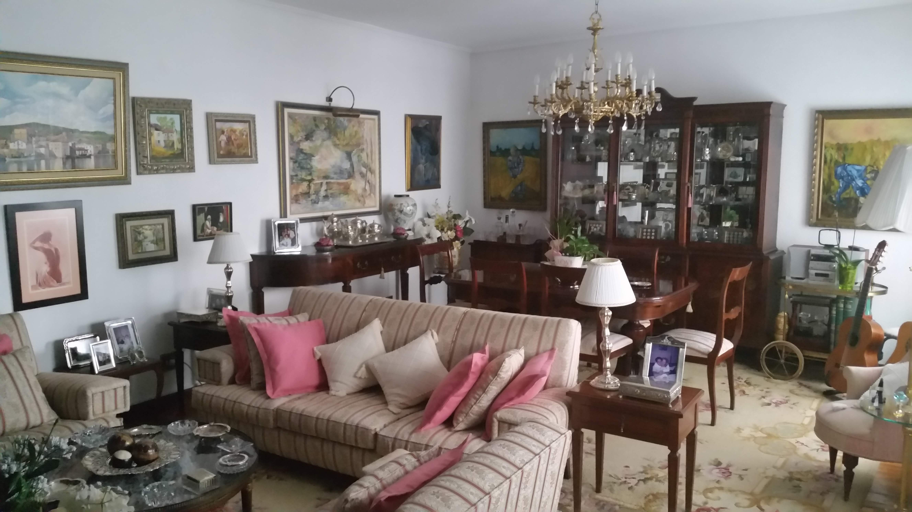

  

  

Now the is the rest of the hall way.  The first door on the left is the kitchen and another smaller room.  The second door on the left is my bathroom, and then the door at the end leads to the other bathroom and the two bedrooms.

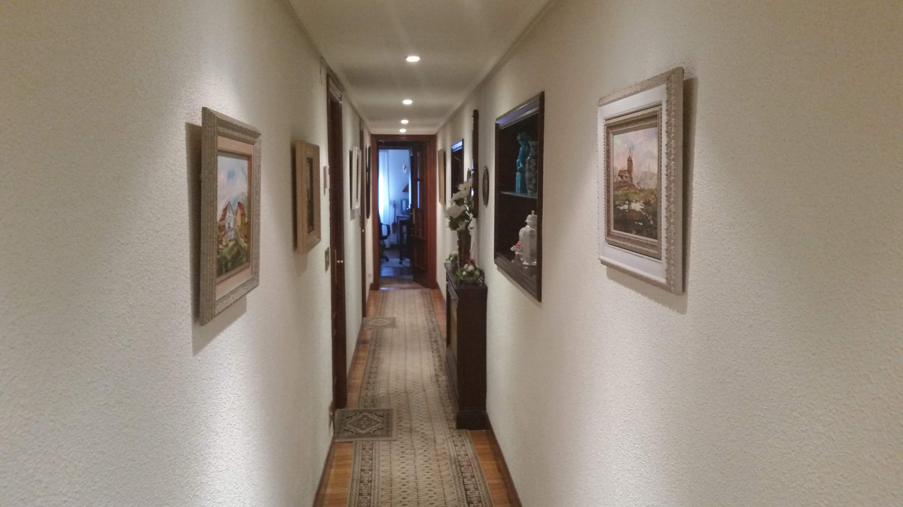

  

  

First I will show you the kitchen.  Its quite compact, but it is definitely sufficient.  It looks like there is two dishwashers, but the one on the left is actually the clothes washer.  There is no dryer, they simply hang the clothes to dry.

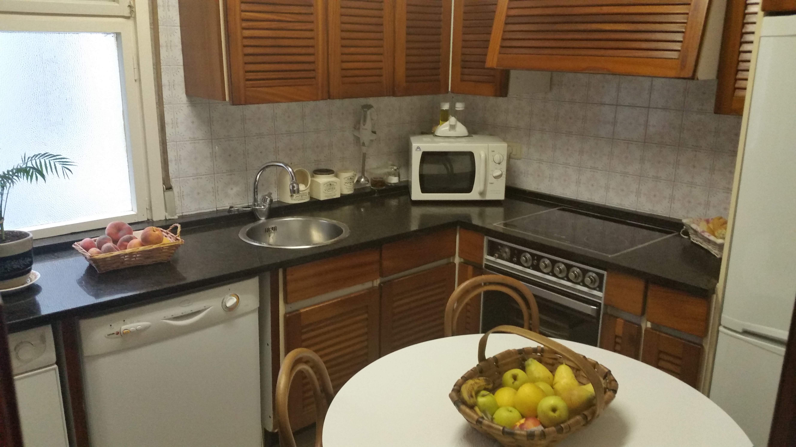

  

There is a door in the kitchen that is a couple feet left of the dishwasher, which leads to this little lounge area. I'm not sure what to call it because I don't know what it would be called in the United States and she didn't tell me the name for it in Spain.  So I guess I'll call it the lounge.  The lounge is where I spend most of my time at home. This is also where I usually find Begoña. We will talk about our day, or about school, or share videos and pictures.  Some times we watch TV or a poorly dubbed movie.  Its a nice cozy space.  Again notice all the stringed instruments. Also, you can barely see it, but on the left side of the wall, there is a U of I pennant left by a previous student.  It always makes me smile when I see it.

  

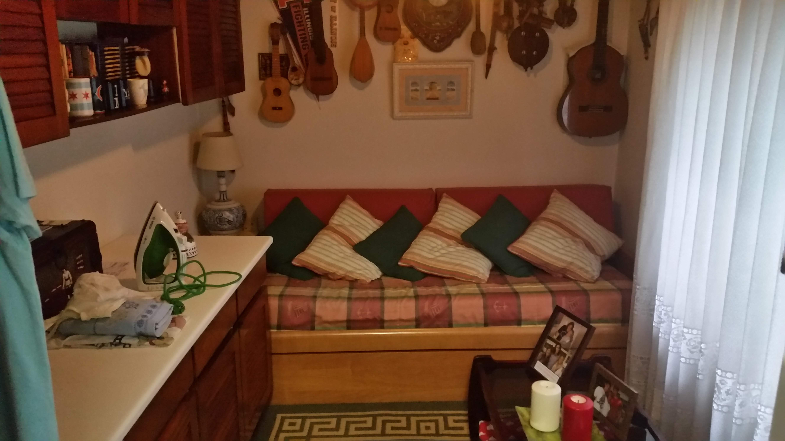

  

I apologize for the vertical photo, but I think it captures the room a little better than horizontal.  Anyways, this is my bathroom. If you remember, this would be the second door on the left in that main hallway.  Its been really nice to have my own bathroom, because I don't have to worry about interrupting anyone's schedule. 

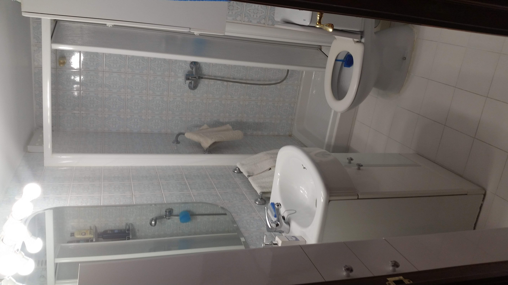

  

This photo was taken in that doorway that was at the end of the main hall.  My room is the one on the right.  Begoña's room is the one on the left.  There is another door on the left that is not pictured which leads to the bathroom. I really love the picture on the wall.  It shows her two family crests.  That of her mother and that of her father.

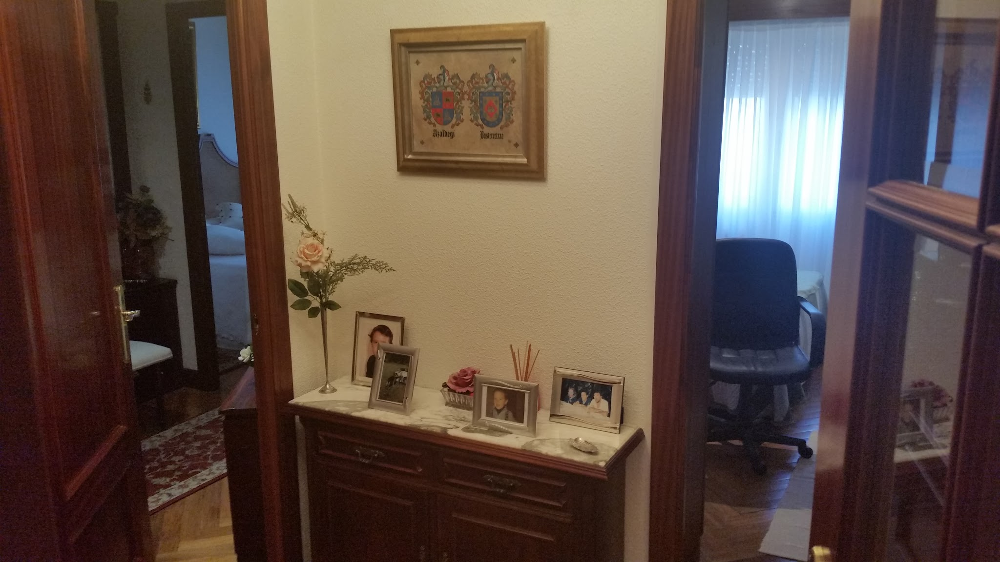

  

  

Here is that bathroom I was just talking about

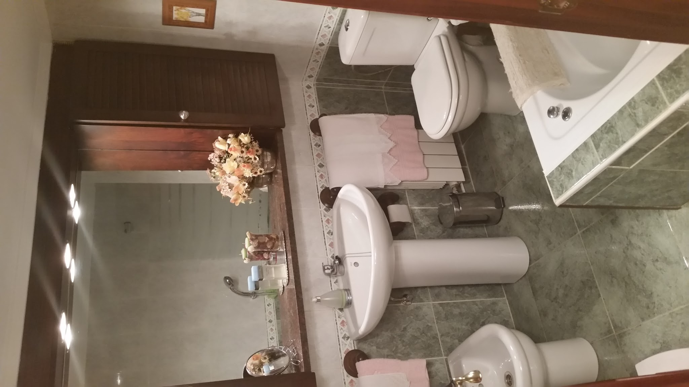

  

If you poked your head in that door on the right, you would see this little room right before Begoña's bedroom. 

  

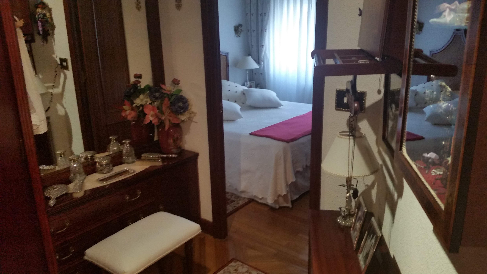

  

Finally, you see my bedroom!! I get some nice big windows with a view of the street.  Right now it is kind of noisy because of the construction, but it is nice to poke my head out and look down the beautiful street.. Again, a couple stringed instruments are hiding in the corner.

  

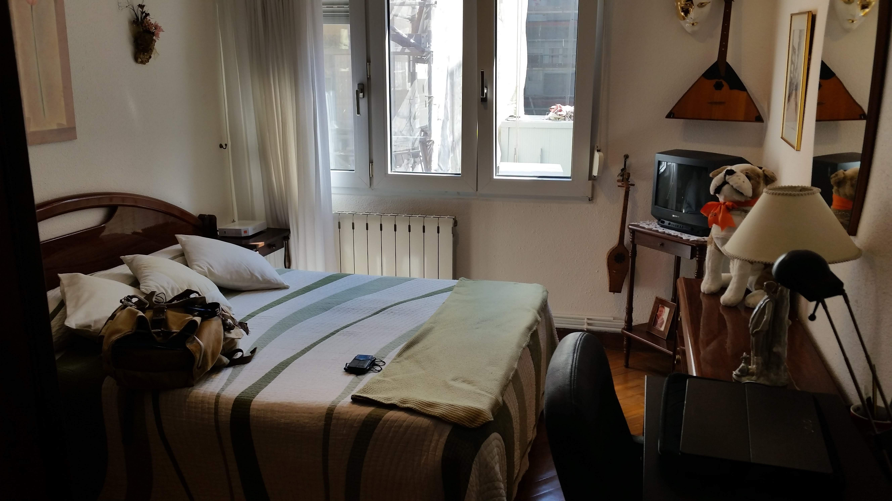

  

Then I took this picture from the other side of the bed. There is no shortage of space as I get these three large armoires to put my stuff in. 

  

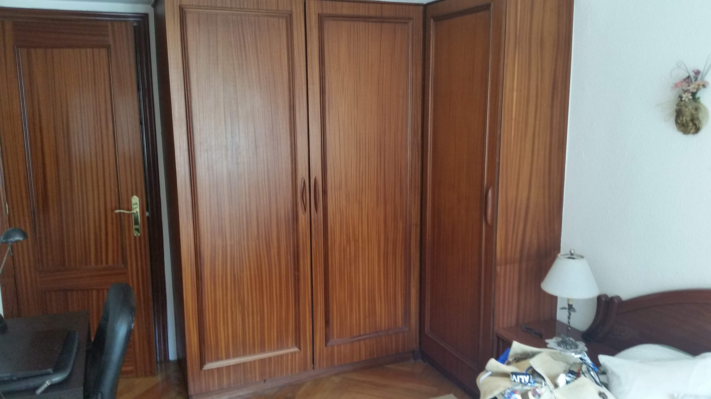

  

So here you have seen my living arrangements. I couldn't tell you if this is the normal for Spain, because I haven't been in anyone else's apartments, but it has been treating me very well during the last week.  All is well over here in España, thanks for reading!