# Playing Catch Up

_Sep 15, 2015_

So. A lot has happened, but I have been busy and a little lazy and haven't been keeping up with this blog.  So this post is going to be quite lengthy. I'm going to try and cover about a week and a half of content, so be prepared! 

  

So where  I left off last update was with our tour off Bilbao!  This tour was great for me and really opened my eyes to the history and culture of Bilbao and the Basque Country.

  

In this picture below, you can see the river and the Guggenheim Museum that is soooooooo close to my school!! This museum is amazing and I love it so much.  I went on a tour of it recently, and I am going to make a post dedicated to just the museum because its that awesome.

  

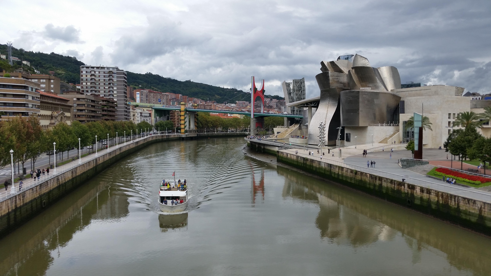

  

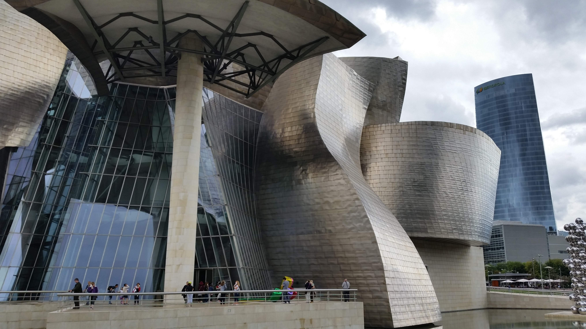

another picture of the Guggenheim I took that day.

So I took that first picture on top of this bridge that goes across the river and connects the two sides of Bilbao.  Its right in front of the university and connects it to the downtown area.  I went back later and took a photosphere on top of that bridge. For those of you who don't know, a photo sphere is kind of like a panoramic picture except instead of it being in a circle, its a sphere!! Its kind of like Google Earth when you can go on the street level and look around and stuff. You can click and drag to move around and up and down and explore. Here is the link to the one that I took on the bridge.

  

[Bridge Photosphere](https://www.google.es/maps/@43.2697186,-2.9369769,3a,79.4y,343.84h,93.28t/data=!3m8!1e1!3m6!1s-VKL367ji6-Q%2FVfFrpeqH-LI%2FAAAAAAAAOcQ%2FaPHwD-_036s!2e4!3e11!6s%2F%2Flh5.googleusercontent.com%2F-VKL367ji6-Q%2FVfFrpeqH-LI%2FAAAAAAAAOcQ%2FaPHwD-_036s%2Fs203-k-no%2F!7i6144!8i3072?hl=en)

  

The things that will stick out are the school (which is what you are pointed at initially), and the Guggenheim. But also notice the Deusto sign on the silver building that is right off the end of the bridge on the opposite side of the river as the rest of the University. That is the new library.  Next to this you will see the Iberdrola tower. This is the utility company of most of Spain. Originally, to me the tower was obtrusive and annoying because it disrupted the old historic feel of Bilbao, but its starting to grow on me. I like that its curved and full of glass. It doesn't feel as industrial as some skyscrapers in Chicago and so that helps it blend more with the city.

  

This is the spot where soccer was first played in Bilbao. This plaque is right along the river and very close to the Guggenheim museum. The plaque is a poem that talks about how the workers would play during breaks and after shifts.  It says that sometimes the ball would go into the river and they would throw rocks to make ripples to push the ball back towards them.

  

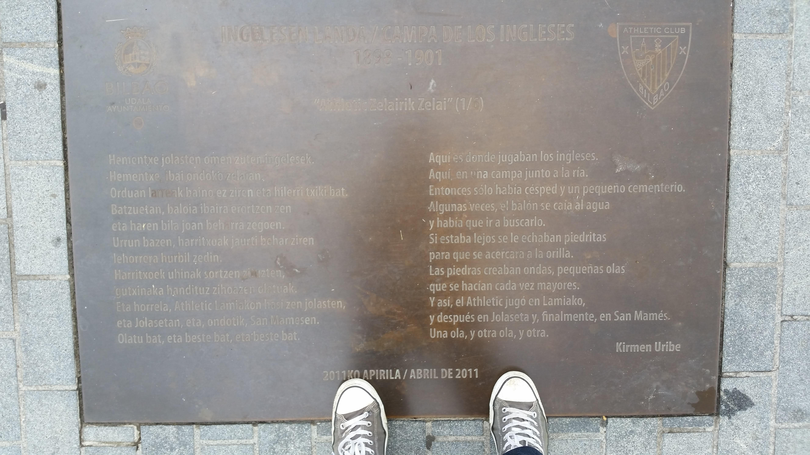

  

Next we made our way over to Casco Viejo, which is like the old town.  Its pretty touristy, filled with restaurants and bars and stores.  I actually saw a story on the news that the Bilbao government was going to ban any more bars and restaurants from opening because there were already too many. Anyways, even though its touristy, you still find awesome things like this cathedral

  

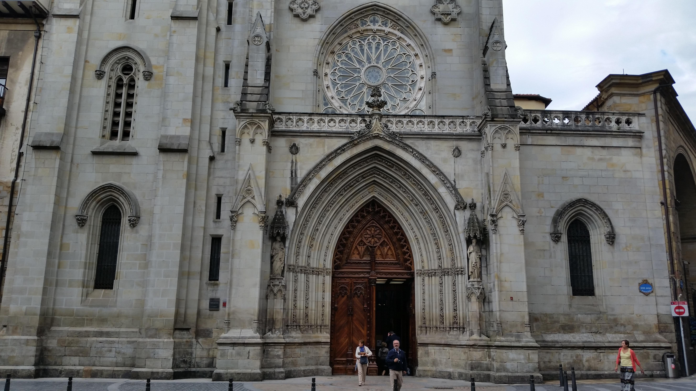

  

Its actually falling over, and so they build some new supports on the side, but even that is falling over as well! You can see in the picture below how that stone column gets moves farther and farther left as you move to the top.

  

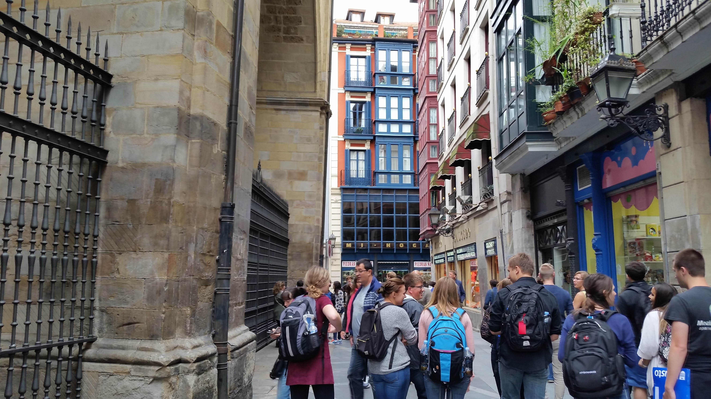

  

Random street photo where you can see all the beautiful architecture.

  

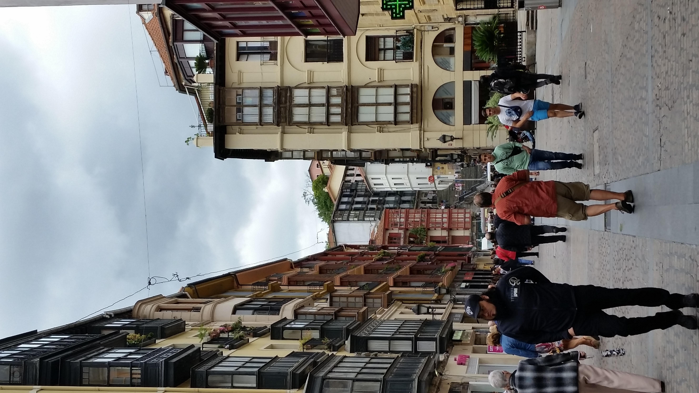

  

We saw this outdoor theater close by the river as well.  It has a really cool floating roof and the stained glass on the back wall are beautiful. There is also a little bar underneath the whole thing as well! Oh yah, its called Arenal Kiosk or Kiosko Arenal.

  

  

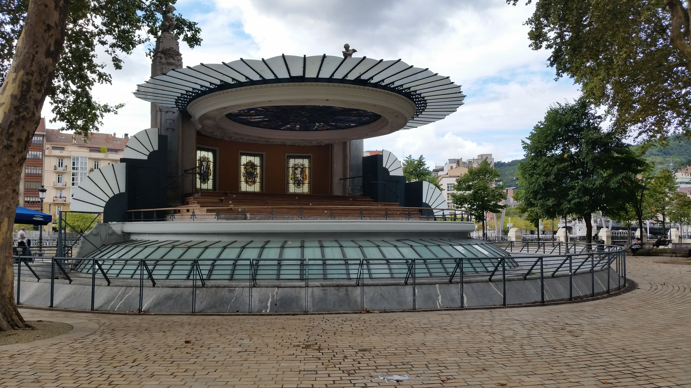

  

  

One day the Soccer team here had an open house where you could walk around the stadium and take a picture with the cup. The line was really long so we only took pictures of the stadium.  Its pretty awesome and I can't wait to go to a game!

  

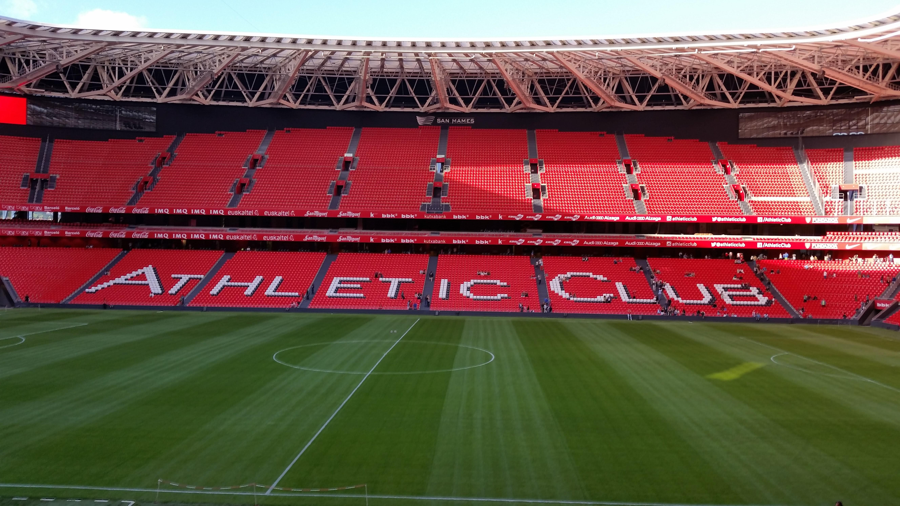

  

Here's a random Photophere I took in front of the business building at my school.  Notice again the giant tower.

  

[University of Deusto: Stairs in front of Business Building](https://goo.gl/maps/QWCXF)

  

There are tons of plaza's every where like this one. It makes the city much prettier by adding more green space.  This happens frequently with the traffic circles.  They fill the inside with a fountain and flowers and a nice walking path.  Its great and I wish we did that in the US.

  

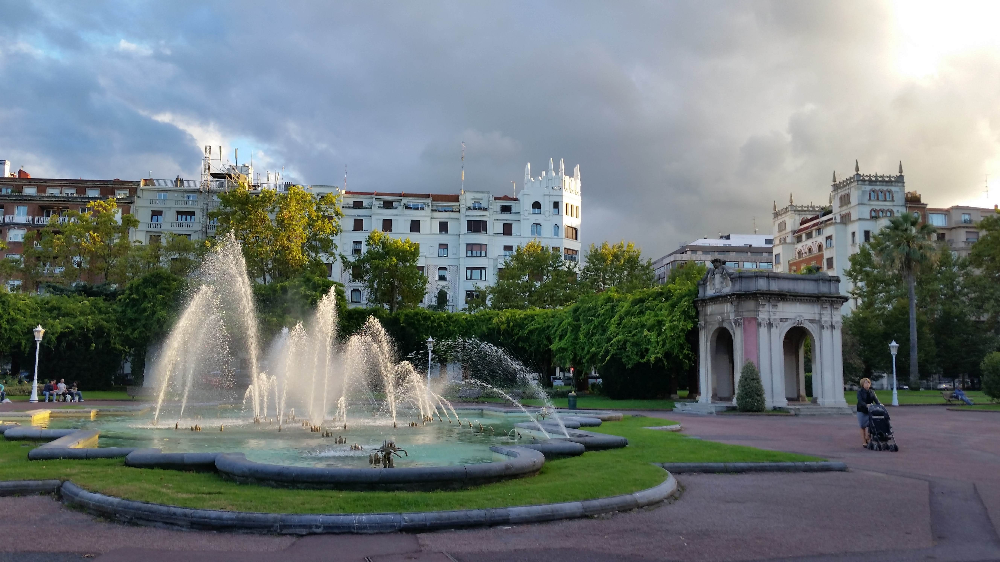

  

Here is another photo sphere I took in one of the other Plazas called Plaza Moyua.  Sorry the fountain got messed up. I'm not sure how that happened. I'm still perfecting this whole Photosphere thing.

  

[Plaza Moyua](https://goo.gl/maps/nxlFi)

  

  

Later that weekend my host mom brought me to the cliff/beach area that is right at the mouth of the river that eventually flows through Bilbao.

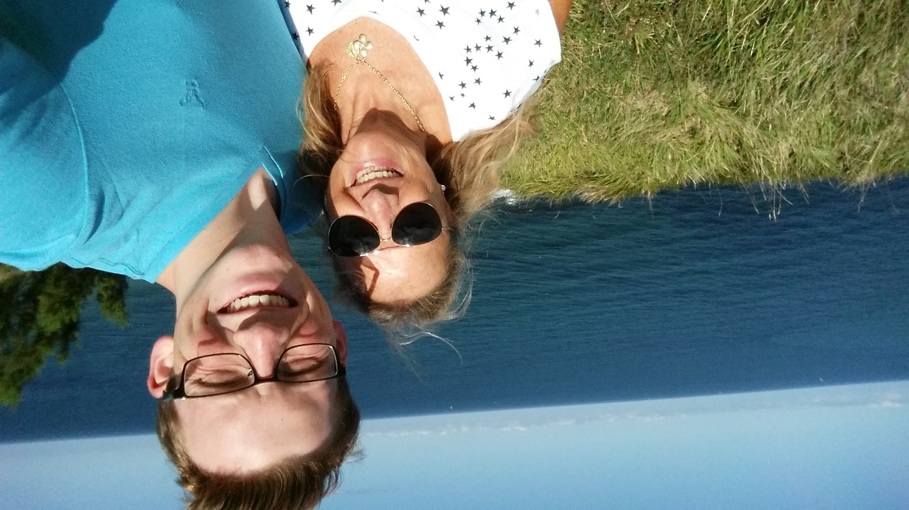

  

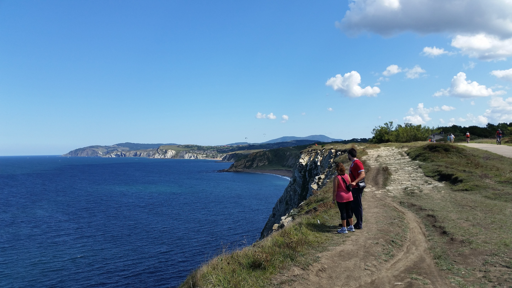

  

  

  

One day there was an British cruise ship in the port so we went to the beach to watch it leave.  There was also a bunch of old people walking around Bilbao speaking English, so that was a little refreshing.

  

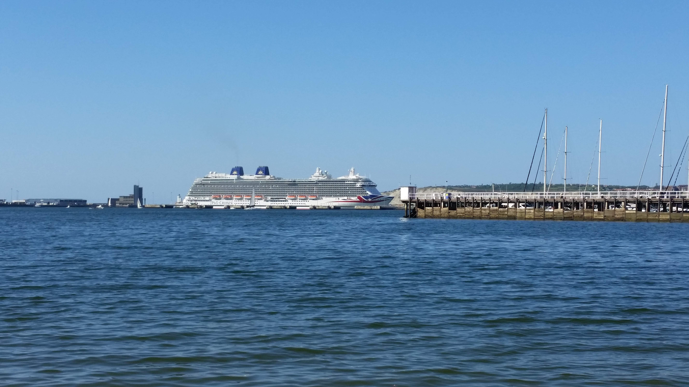

  

On Wednesday, a group of about 4 of us decided to see The Sister Act at this beautiful 

theater called Teatro Arriaga.  It was in Spanish, but since it was a musical, the actors spoke very clearly and articulated very well.  The show was easy to follow and I understood a lot of it! It was well worth the 22 Euro.

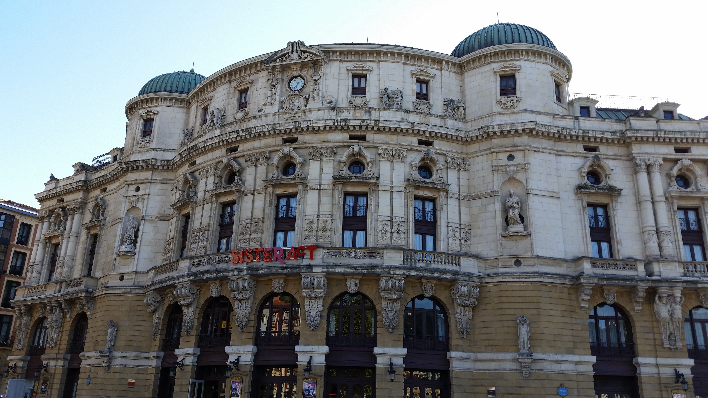

Picture from the outside. You can't see this, but it is right on the river!

  

  

  

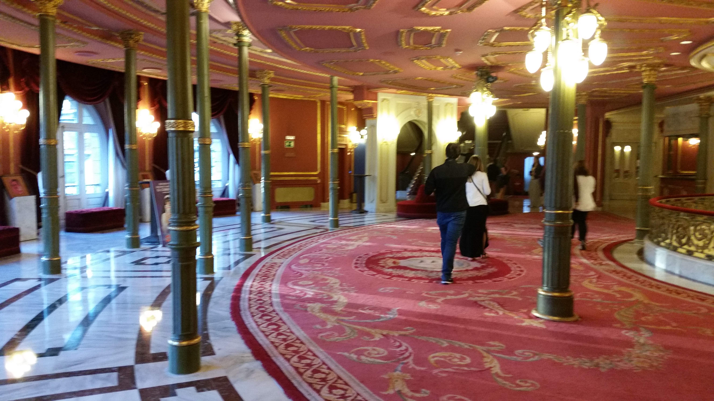

Inside atrium area

  

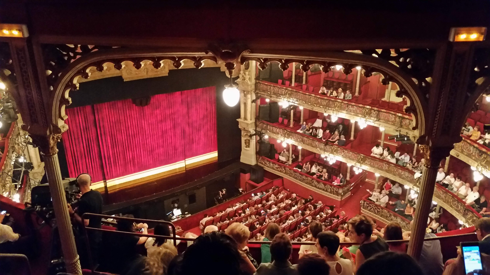

The view from the highest of the highest seats! but hey it was like $25

  

One day we decided to go up the mountain side to see the city from up there.  It was an amazing view.  Sadly it was cloudy, but that's how it is here most of the time unfortunately.   I really want to go back up and see the city at night. I've seen beautiful pictures from other people who went up at night.

  

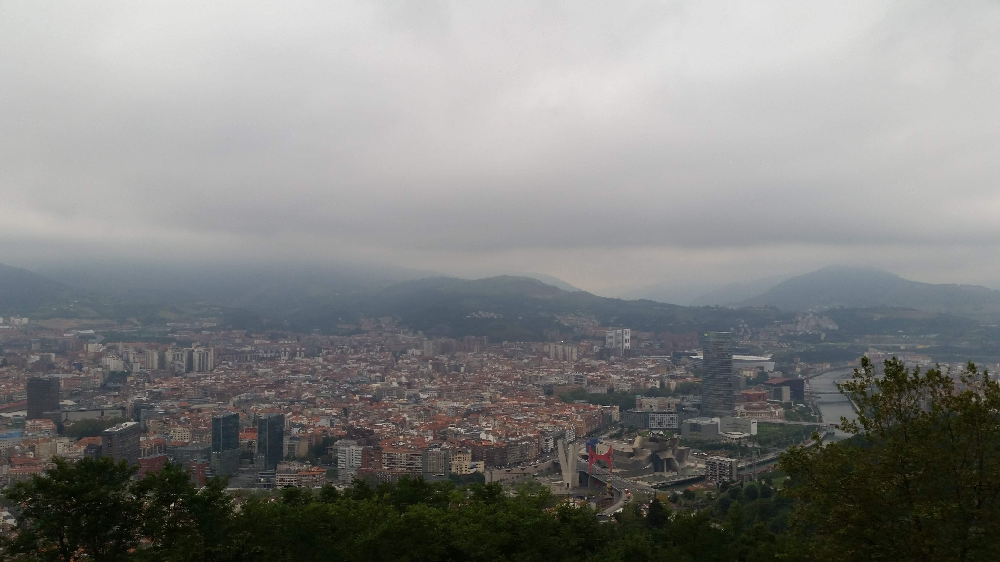

  

  

On Friday, I was writing postcards at my desk, and I put two arms on the desk, and then the back two wheels broke off! I freaked out quite a bit and I was angry that I broke it.  I looked down at the wheels and noticed that the piece of wood it was mounted to, was too small. Thus each wheel only could fit two screws when each one needed four. 

  

The next day, I let Begoña know that I had broken it. I was a little afraid to tell her and kinda embaressed I did it.  When I told her, she told me that she knew it was unstable and that she knew it was going to break.  She said it wasn't a big deal and that she had a board she wanted to use to fix it.  I said "Okay! Let's do it tomorrow!". She laughed and asked me if I was serious. Of course I was serious! So most of Sunday went towards fixing this desk. 

  

It was definitely an interesting experience.  I learned a ton of new words and taught Begoña some new tricks.  As you can see, we ended up doing all of the woodwork in her small kitchen.  It was kinda cramped which made it pretty unique.  I've never cut a board that was halfway out of a kitchen window, and then had a 60 year old woman sitting on the counter to keep it from moving.  It was a new experience for sure.

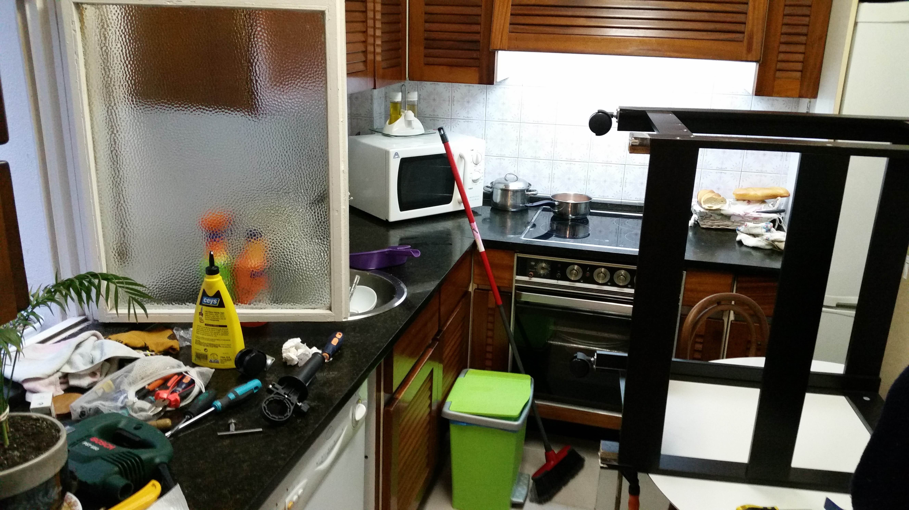

this picture really doesn't do it justice

  

One of my favorite things that happened this week was when we went to Puente Colgante.  Its definitely top 3 favorite things of this city.  I love how big and outrageous it is.  It is such an interesting take on the problem of boat and car traffic.  The bridge has been around forever, 1893 actually.  The technical name is transporter bridge and there are only 12 still running in the world.  It was partially destroyed by Franko during the Spanish Civil War, but they fixed it up and its as good as new!

  

  

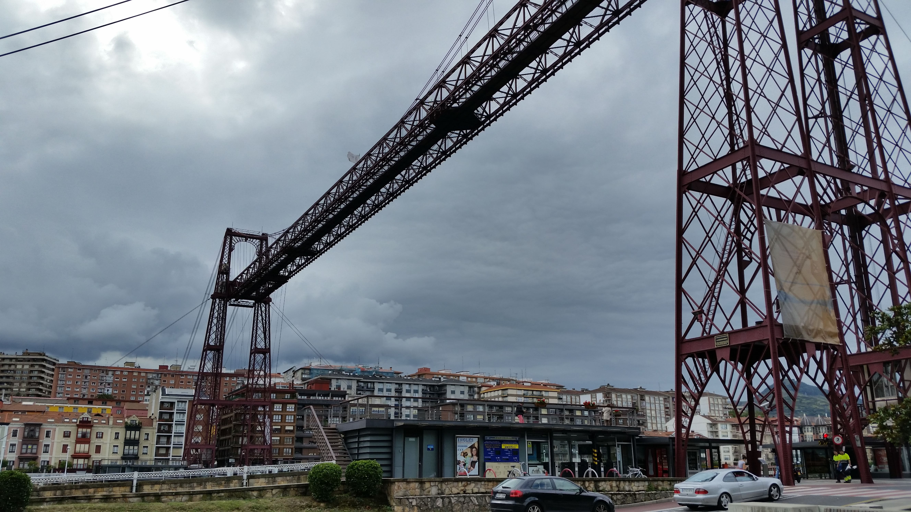

  

I didnt take this next picture, but I wanted to give you guys a better look at how the ferry thing attaches to the bridge part.

  

  

  

We went both across on the ferry ship thing and we also walked across the top of it. So here is two pictures from our trip across on the ferry.

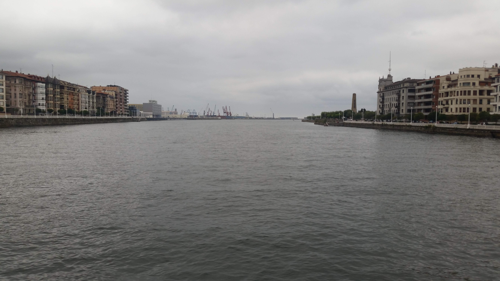

  

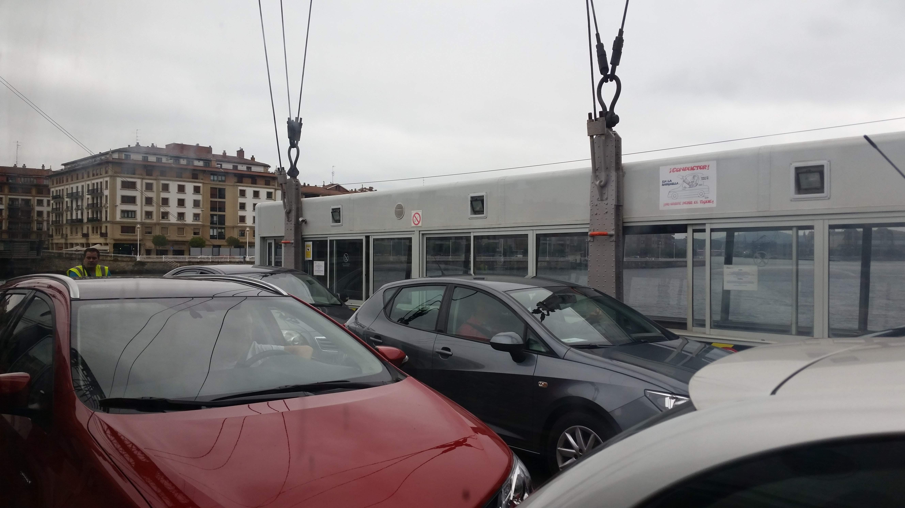

  

And then here are some pictures from the top.  Its so beautiful from up top.  You can see so far! Its also realllllllylyyyyy high. and it shakes when the ferry goes across and sways a little in the wind.  I didn't like that at all.  However, it was worth it for the views!

  

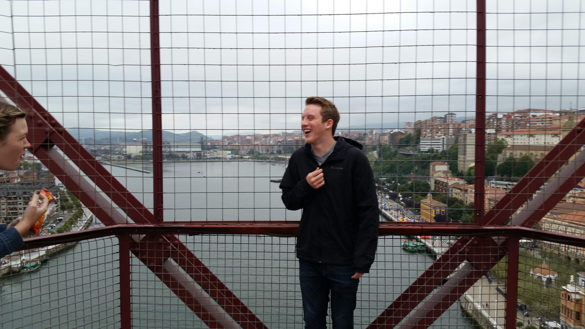

  

I found it interesting that it looks like a truss bridge, but its actually a suspension bridge, they just hide it really well.  

  

Yes, I'm a nerd.

  

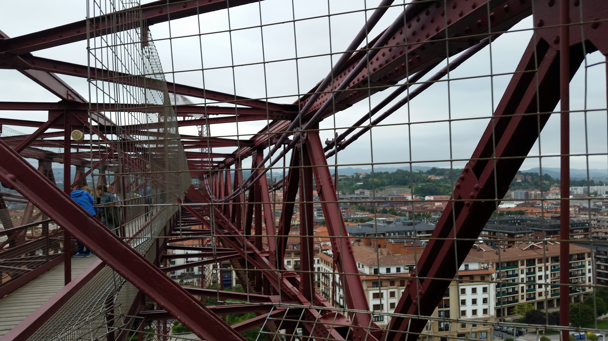

  

I put my phone through the wire mesh and I risked its life for this panorama, so you better look at it 

  

  

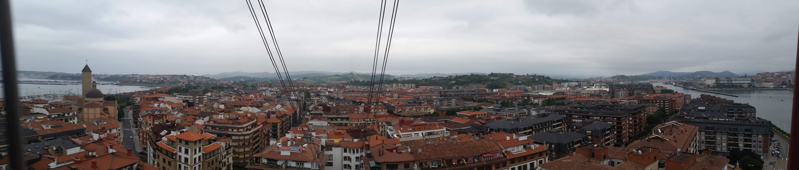

  

Also, a photosphere too, because I think they are so cool!!

  

[Puente Colgante](https://goo.gl/maps/YRpLN)

  

  

Oh yah, and one random day we went to Plentzia beach, Its super pretty and it was a lot of fun! We swam out to the boueys and talked to some open water swimming. We body surfed.  We kind of saw the sunset.  It was behind the mountain and it was kinda cloudy so it didn't really look that nice.

  

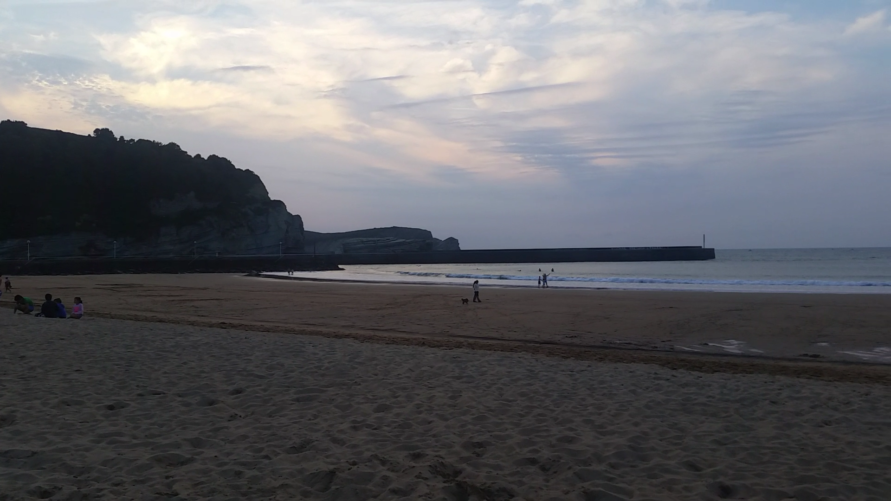

  

I really want to come back here and hike the mountain and rent kayaks and go down the river or maybe out on the ocean.

  

  

  

Also....another Photo Sphere. You guys gotta tell me if you like them, because I think they're awesome, but if you don't look at them then I'll stop putting them in here.

  

[Plentzia Beach](https://goo.gl/maps/L1XpB)

  

Okay, people.  Thats basically all I have for now.  I'm going to try and get better at posting regularly on Sunday and covering the previous week. Stay tuned!!