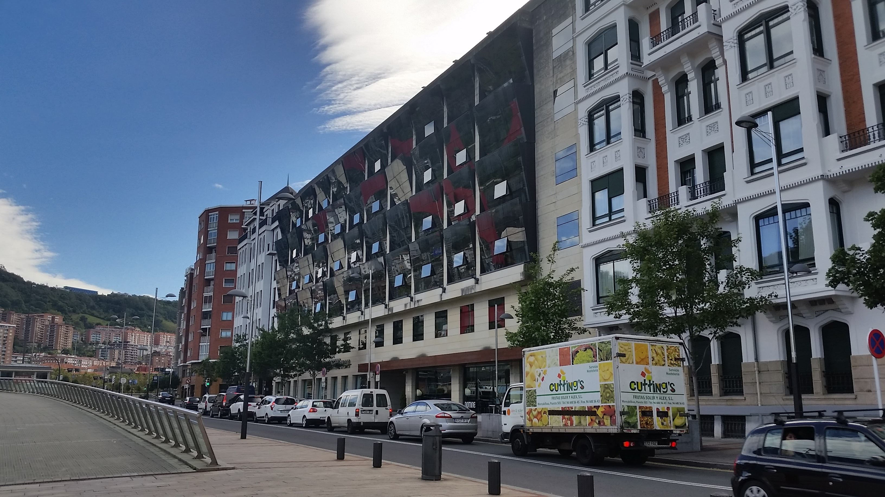
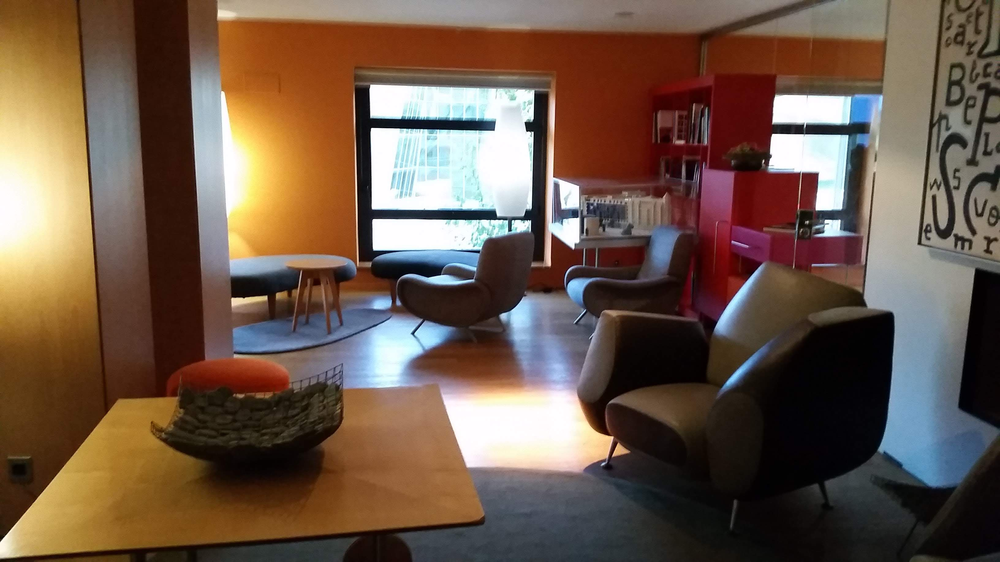
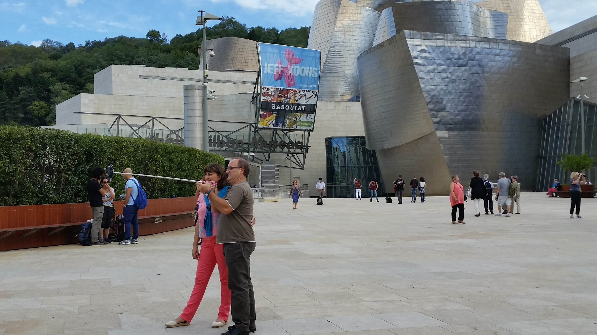

# Pro tip: Don't Lose Your Passport

_Sep 20, 2015_

So.  I had just arrived to Bilbao International Airport, I got my passport stamped and then met my host mom. We went home and unpacked and got ready to go out for pintxos (it’s the Basque word for tapas(tapas is the Spanish word for small dish or snack). When I was getting ready to leave, I decided that I should probably bring my passport just in case.  I couldn't find it though.  I wasn’t too worried because I figured it was somewhere in the room.

  

When we came back later that night I decided to dig around a little more.  I looked around the room and in my backpack and suitcase and pockets.  At that point I had to tell Begoña.  When I told her, she freaked out (I found out later that this is more her personality to do kinda over react a little, but at the time, it was the first day!) and I felt pretty terrible. We tore apart the room and all of my clothes and my backpack and my suitcase and the house and the car.  Nothing. 

  

This is when I panicked.  It also didn’t help that Begoña was freaking out too.  I spent a couple hours of that night searching info about my passport and figuring out what I needed to do. I reported my passport as lost or stolen and sent an email to the embassy asking for more information. The next morning I called the embassy, but I got an automated response telling me to visit the website. Classic.

  

Through my research I found that it was best for me to make a trip to Madrid to visit the embassy and request a new passport.  I signed up for the next available appointment; a Thursday morning in two weeks.

  

At this point I was upset I lost it, but I didn’t think that it was going to be that big of a deal.  I wasn't going to miss class because of the way my classes are set up, and I might be able to see a little bit of Madrid.  I was a little upset that I wasn’t going to be able to travel during a long 4 day weekend coming up in 3 weeks because the passport would take too long to process.  My friends were talking about going to London, but my passport wouldn't arrive until 4 weeks.

  

The very next day after I signed up for my appointment, my friend Matt showed me this email from the US travel office.  The email said that there were representatives coming from Madrid to Bilbao to deal with passport issues, on the very same day that I signed up for an appointment in Madrid.

  

YES!!! This was perfect!!! I would save time and money! Immediately I sent an email for the travel office asking to be given a time slot for when the representatives visit.  When I sent it I was told to get a response in about 3 business days.

  

Except it had been 6 days and I still heard nothing. Someone from the CIDE office told me that they were going to contact the embassy and see what was going on.

  

Then 2 hours later I received an email from the embassy! They told me that they sent me an email 3 days ago, but I know I definitely didn't get an email.  The email said that they would be able to give me a time slot on Wednesday morning at 9:00.

  

Perfect.  Now all I needed to do was get a passport photo.  There aren't any Walgreen's here to take your picture like in the states.  I spent about an hour searching on Spanish google and ended up finding a couple places that I think could do it.

  

The first store went okay. He took my picture, but they didn’t have the right size photos.  I tried to explain it to the guy, but I don't think he understood US passport photo requirements.  I paid for the large photo anyway and made my way to the next photo store. 

  

This guy was awesome.  He understood the special requirements and let me see the picture before he printed it. He printed two pictures, perfectly sized on one sheet of picture paper.

  

My appointment was at 9:00 AM the next morning, so I woke up at 6:30 so I could get there early.  Except I'm not a morning person so it ended up being 7:00.  I didn't end up leaving the house until 7:30 which is cutting it really close when the commute is about an hour.

  

I was opening the door to leave the apartment, I was running through a checklist in my head of the stuff I needed. Then I remembered if forgot to cut the pictures out!

  

I went into MacGyver mode. I didn't think I had ever seen any scissors in the house before.  I started opening drawers in the kitchen. I couldn't find anything.  I started contemplating using a knife to cut the paper.  Then I remembered that there was little scissors (I think they are used for nails or something) in the my bathroom drawer!

  

I rushed over and frantically cut out the pictures with these little baby nail scissors. It wasn't exactly straight, but it would have to do.

  

7:45. I was running to the metro. Anxiously I waited to get off and start booking it to the hotel where the embassy workers were.

  

The super nice hotel where the meeting was

I overestimated the time it would take to get there and I ended up 15 minutes early.  Except there was no one in the room where it was supposed to happen.  I waited until 9:05 (5 minutes after my appointment) and then I called a personal number that I had found on an email.  The woman answered and told me that she had "accidentally sent me the wrong time". Except she had sent me that appointment time 3 different times.  So I'm not sure what happened there

waiting room

  

She explained that my appointment was actually at 12:00.  I tried not to be too upset and I took the afternoon in full stride. I got coffee and a croissant from a local café and read the newspaper in Spanish.  Then I went across the street and spent 2 hours in the Guggenheim museum.

  

Tourists looking touristy

  

At 12:00 I finally had my meeting with the embassy and I had great news! First, they said my photo was fine, no problems there.  Second, they said that I was going to go on the London trip for sure.  They said that they could get me an emergency 1 year passport (valid for one year) to me in less that 4 days.  They also said that they can usually get me a 10 year passport in about 2 weeks, but it depends on how busy they are. 

  

After these long two weeks of research and emailing, it was so relieving to hear that I would be getting a passport so soon.  I'm not sure which one I will get yet, because they haven't updated me yet.  However, the next hurdle will be obtaining my student visa.  This was attached inside of my passport and the US embassy had no idea what to do and neither did my school.  I'm going to try and talk to someone in the city this week, so we will see how that goes. 

  

  

So morale of the story.  Don't lose your passport. But if you do, its not the end of the world, and the embassy can save your butt.