# Bilbao Weekend

_Nov 18, 2015_

So this week I didn´t have any big trips out of the country, but it still sure was a memorable one  
  
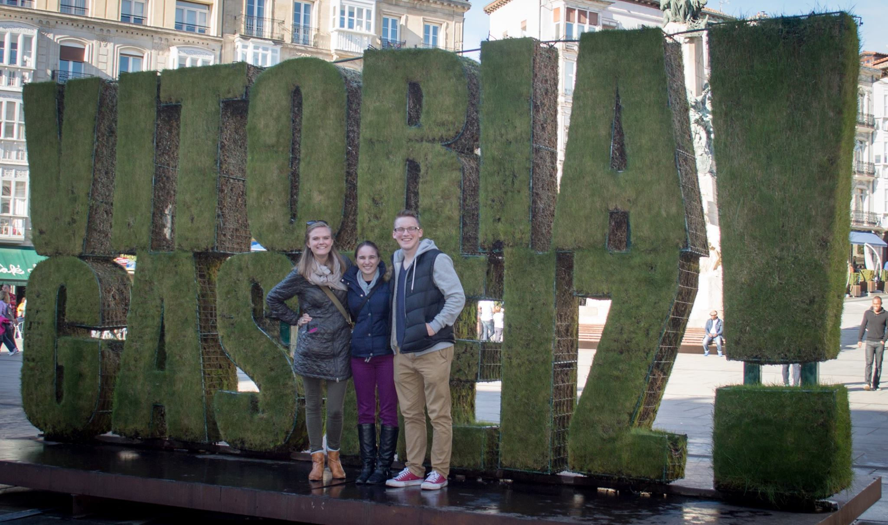  
  
I´m going to start this blog talking about food, because everyone loves food!  
  
This is a pintxo that I had of "tortilla de patata" which is like an omlette with potatoes in the middle  
  

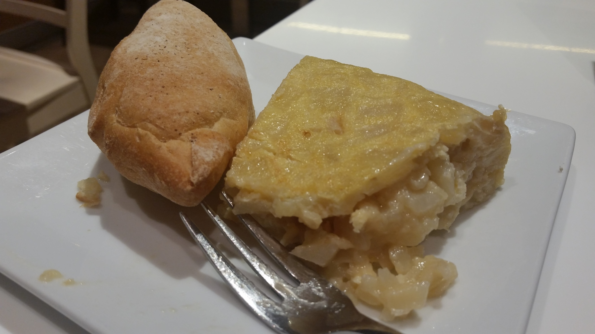

  
Next up is some ribs with thinly sliced potatoes.  
  

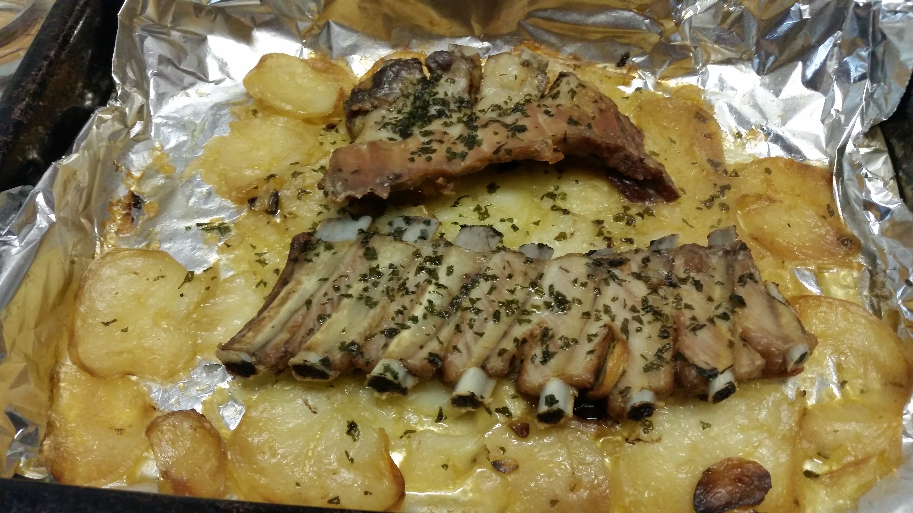

  

I'm not sure if I have mentioned this yet, but the people here love their purees here.  We probably have one or two a week.

  

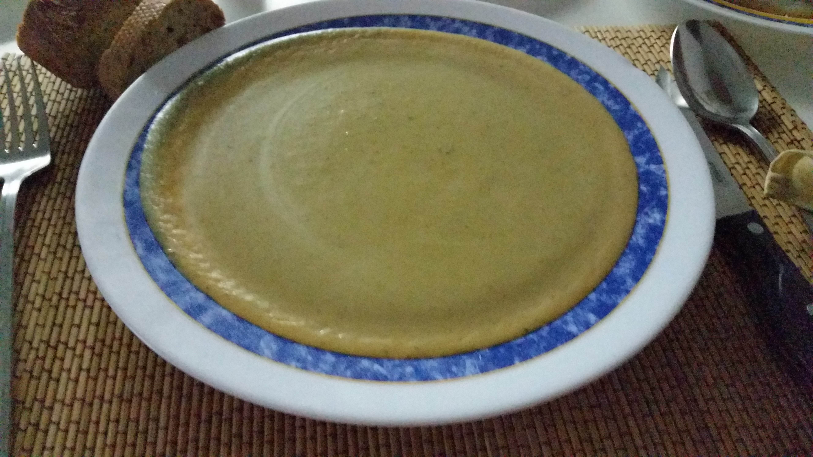  

  

So this next one is mussels with rice, which is interesting because I have a shellfish allergy. However, I ate it anyways because I'm young and stupid.  When I came home one day, Begoña showed me the dish very proudly telling me it was one of her favorites and that she couldn't wait to see what I thought.  I really did want to try it, and so I decided to google "can I eat mussels with a shellfish allergy".  Great search terms right?? Well, it turns out that there are two categories of shellfish: crustacea and mollusks.  Custacea is crabs, shrimp, lobster and mollusks is squid, octopus, mussels, clams, scallops. I figured that because I was fine when I tried octopus and squid, I should be okay with mussels.  So I ate it, and here I am typing this blog!

  

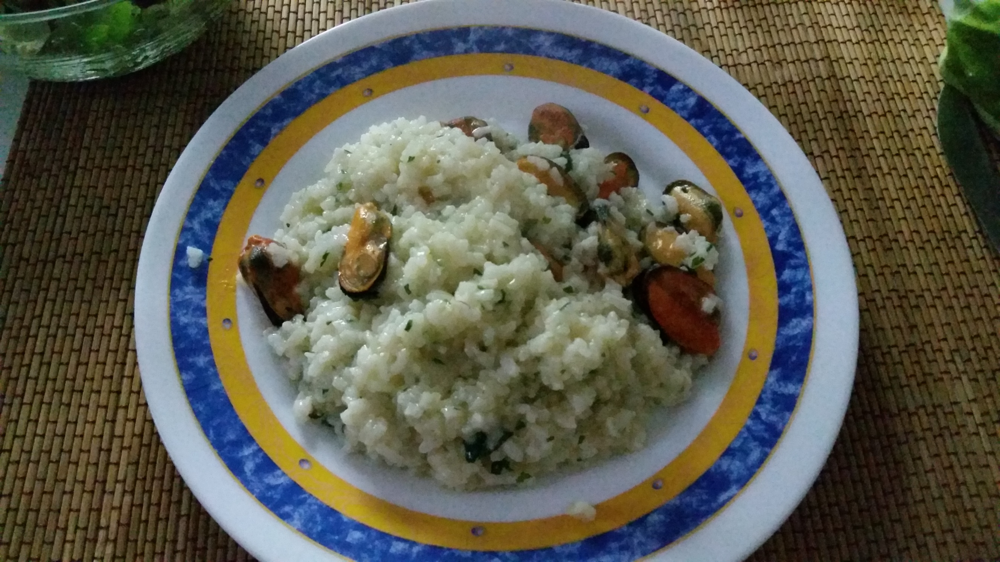

  
One random thing real quick, there are always pigeons in our school.  They tend to leave the doors wide open.  Its not really a big deal because the weather is always so nice, but the pigeons get in to scavange for food. Its kinda startling when they fly over your head in the hallways.  I took this picture from the schools little cafe.  They were inside eating food, but I didn't notice them until they flew right past my face.

  

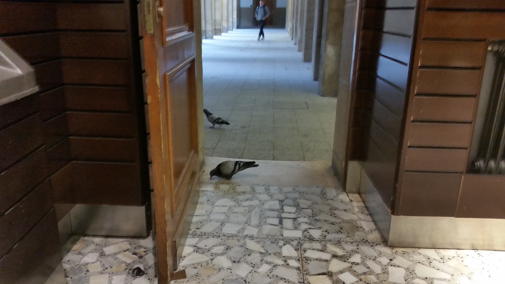

  

### Hair Cut

  

On Monday, I finally decided that I had time to go get my haircut.  My friend Matt told me about this awesome Brazilian guy by his house that cut hair for 10  
Euro.  So Matt showed me were it was on a map and I headed over there.  When I got there I saw a barber shop and so I walked right in.  As soon as I sat down inside I realized I was in the wrong spot.  Everything was in Arabic, and the barber was definitely not Brazilian. The guying getting his hair cut and the barber were both Middle Eastern and speaking what I assumed to be Arabic.  After I sat down, I couldn't really just get up and leave, so I decided to stay.  
  
The barber was actually quite the character, he was wearing a white track suit and had one pant leg rolled up to his knee.  He was also wearing a sideways flat brim hat and had a very full beard.  However, he spoke enough Spanish so that I could tell him what I wanted.  Now, it didn't come out exactly how I wanted, but in the end it only cost 8 Euro.  Who can argue with an 8 Euro haircut?

  

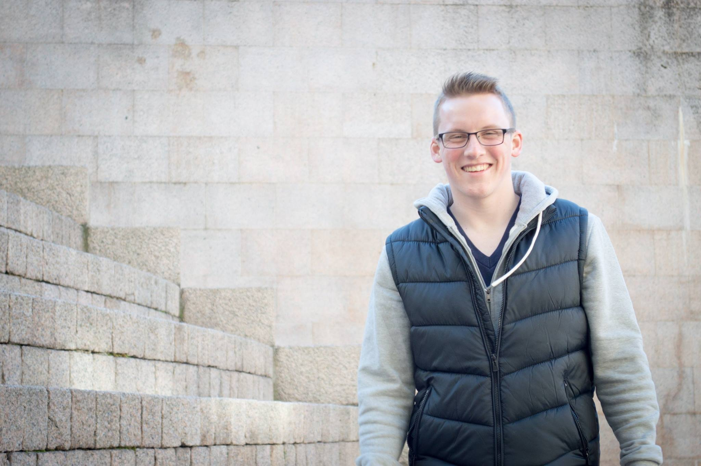

  

### Zuricalday

  

So just like the weeks before, I went to the Zuricalday bakery on Tuesday for half priced pastries.  
  

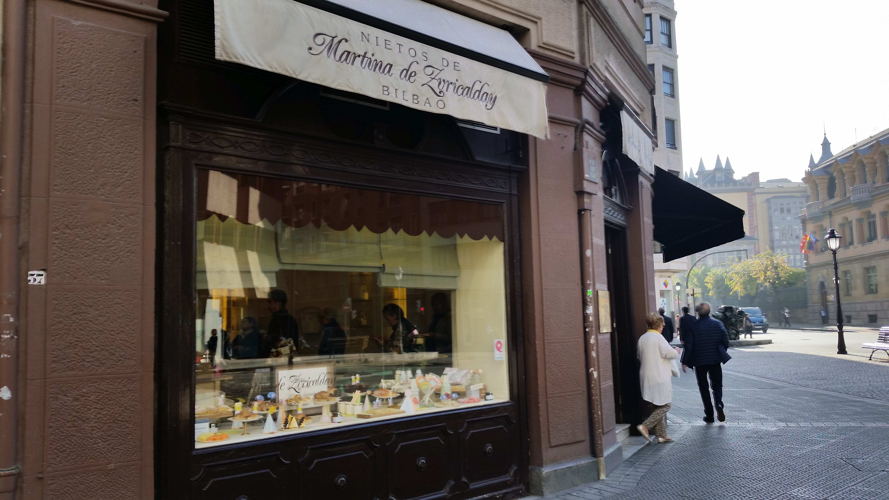

  
  I had a little long John donut, but it was stuffed with pudding.  and then a "bollo de mantequilla" which means "butter bun".  Its a sweet bread with sugar on top and butter in between the two slices, but its not actually butter.  Its also egg whites, sugar, flour, and milk.  This is a very typical Basque pastry and you can't get it anywhere else in Spain.  
  

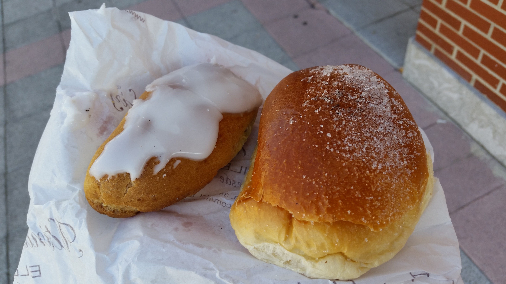

  

  

### Guggenhiem

  

On Wednesday, I had some time after class and I decided to stop by the Guggenhiem.  I have the 6 month membership and so it is free for me to go for the whole semester.  
  

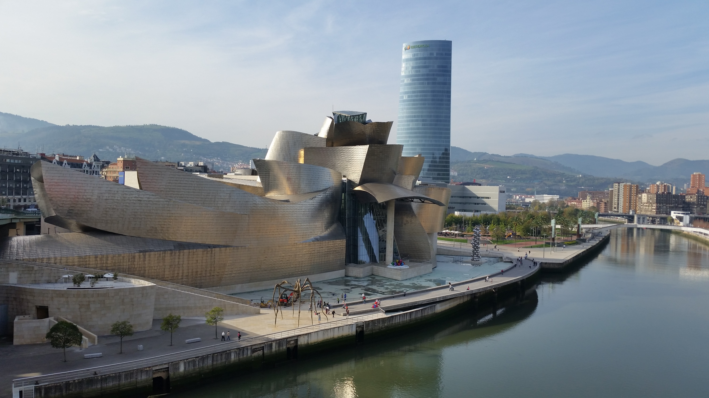

  

I really wish that I could show you guys pictures from inside with all the different exhibits, but they are pretty strict about photography.  There is at least one person in each room looking out to get you when you hold up your phone.

  

They just changed the exhibits in the Guggenhiem so it was great to see all the new stuff they have set up.

###   

### Thursday Night Adventures

  

So when I was running along the cliff in Getxo that goes along the bay, I noticed that there was this big pier down below.  The pier is at the very edge of the bay, and the cliff is probably 200 ft high, but there is a big switchback logging thing that leads to the water.  I thought it would be pretty cool to go out there and so I asked my friend Alex to go with me.  
  
I really wish I had pictures to show you guys what it was like, but this is the best one I have right now.  I´m going to go back in the day light to show you guys a little better.  
  
  
  
But anyways, so we started making our way down the switch back.  It was very large and beaten down. You could have easily driven a car down it, until we got to the second half.  The second part was much less worn, pretty muddy and about half the size. Then it suddenly stopped.  There was a pretty steep slippery rocky slope that we needed to go down. Luckily some one left a rope for us to use to get down.  
  

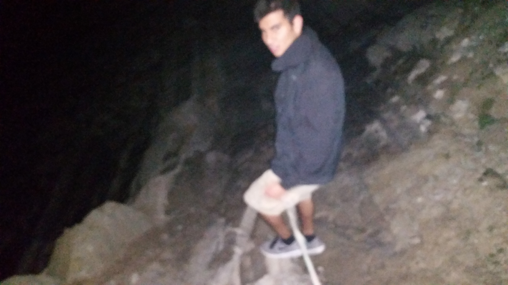

  

Once we got to the pier, we realized that they were kind of like giant cinder blocks.  They were about 8 or 9 feet tall and about 15 or 20 ft wide.  Each one had two giant holes in the middle.  It would have been hard to get up on top, but people had left pieces of wood that we used as ramps and step ladders to get to the top.  The scariest part was shimmying down this skinny path. 

  

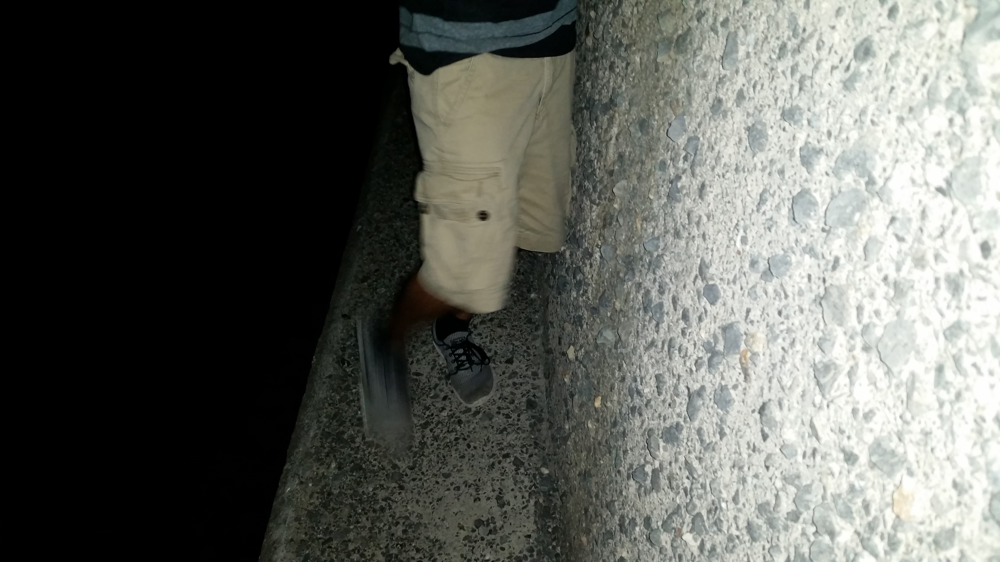

  

When we finally got on top, we walked to the end of the pier, avoiding those big holes along the way. At the end we were pretty far out into the ocean and the waves were big and splashing up against the rocks.  It was really peaceful!

  

### **Mall**

  

The next morning was a no alarm kind of day, but I still woke up at 8 despite being up until two the previous night.  I spent the morning moping around and talking with Begoña about France.  At about 11:00 I headed out to go to the mall. 

  

  

There is actually two malls in Bilbao, one in the center of the city and one farther out.  I heard that the one farther out was cheaper and so I decided to check it out.

  

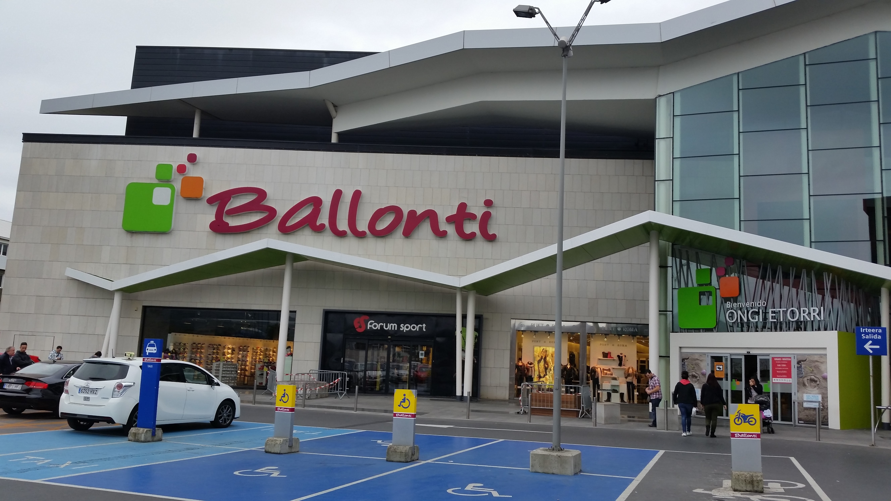

  

I went to this one store called New Yorker and I think it was the most entertaining.  I'm not sure if any one from that store has even been to the United States, let alone New York. They had all kinds of sports apparel with weird teams and bizzare English phrases as well.

  

  

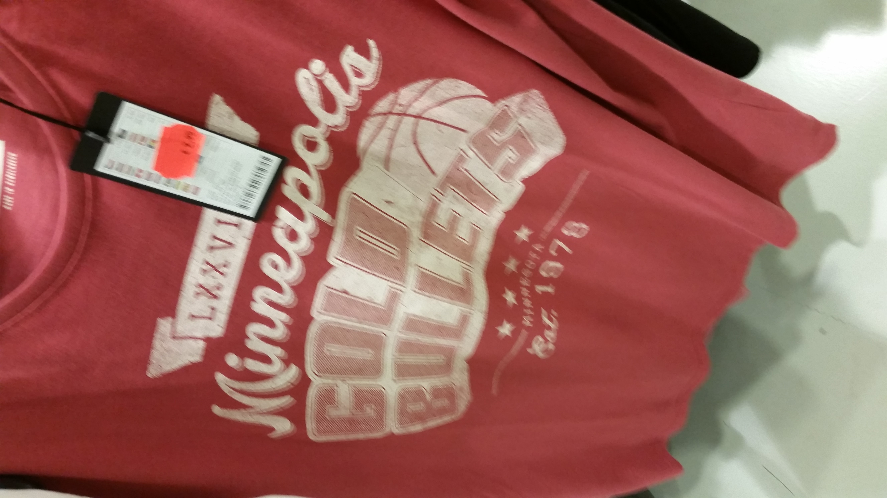

  

Overall though the mall was great.  It was a little nostalgic and it made me miss home and hanging out at Woodfield.

  

### Friday night

  

So later that night, I was watching the friendly between Spain and UK.  The announcers were speaking in Spanish, and so it is difficult enough to listen to them because they speak so fast, so when they mentioned the attacks in Paris, it went right over my head. 

  

I wouldn’t have known if my host mom wasn’t in the next room.  When she heard that, she whipped her head around and asked me in Spanish “Attacks in Paris??”.  So we switched to the news and watched everything unfold.  It was kind of scary because I knew so many people that were visiting Paris that weekend.  

  

There was 12 in Paris, and another one of my friends in Lourdes which is a southern city in France.  I immediately started texting everyone, and some of them didn't even know what happened.  I contacted everyone within an hour, but we kept talking for most of that night.  We were a little worried because France said they were going to close their borders, but everyone was able to return home without problems.

  

  

Talking to them the next few days were interesting.  We found out that about 5 of them were only a couple blocks away from the restaurant.  Most of my friends went and paid their respects.  They said that nearly everything was closed, and so they mostly just walked around and took in the city.  

  

### Victoria

  

On Saturday, I went to Victoria for the day! Victoria is a relatively small city, but it is the capital of the Basque Country.   
  

  

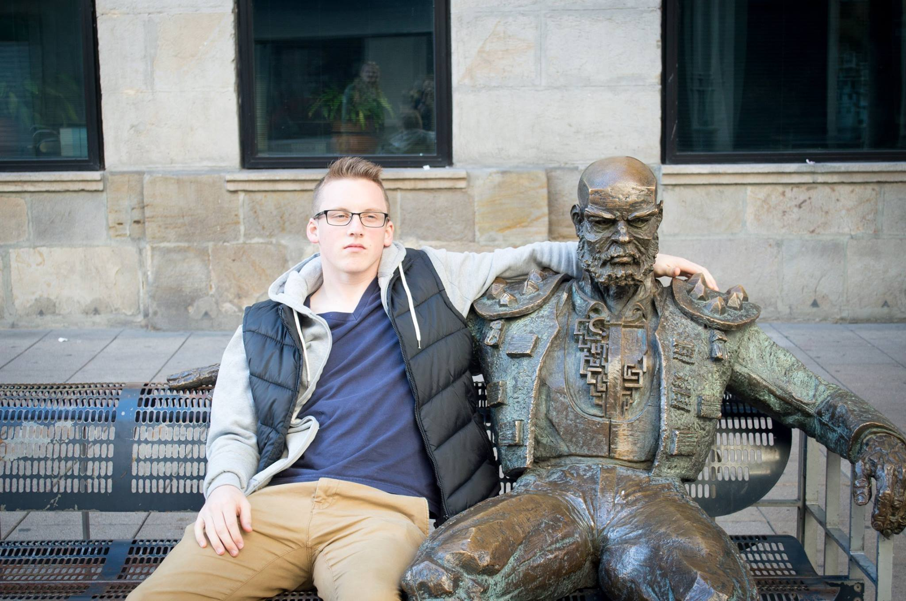

  

We mostly spent the day walking around the city and just taking it all in.

  

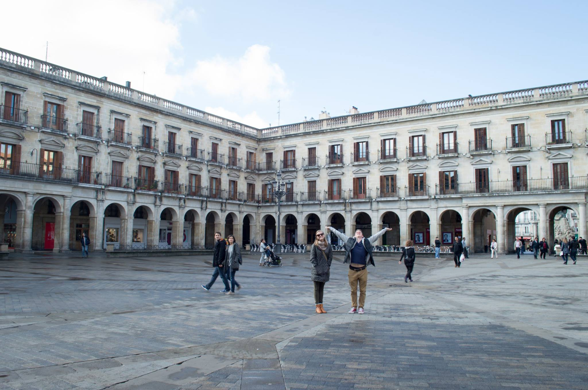

  
Victoria was much more tranquil than Bilbao.  The buildings felt older and the city just felt like it was a little more historic and more pristine than Bilbao.  Bilbao tends to have a lot of modern developments that pop up everywhere.  
  

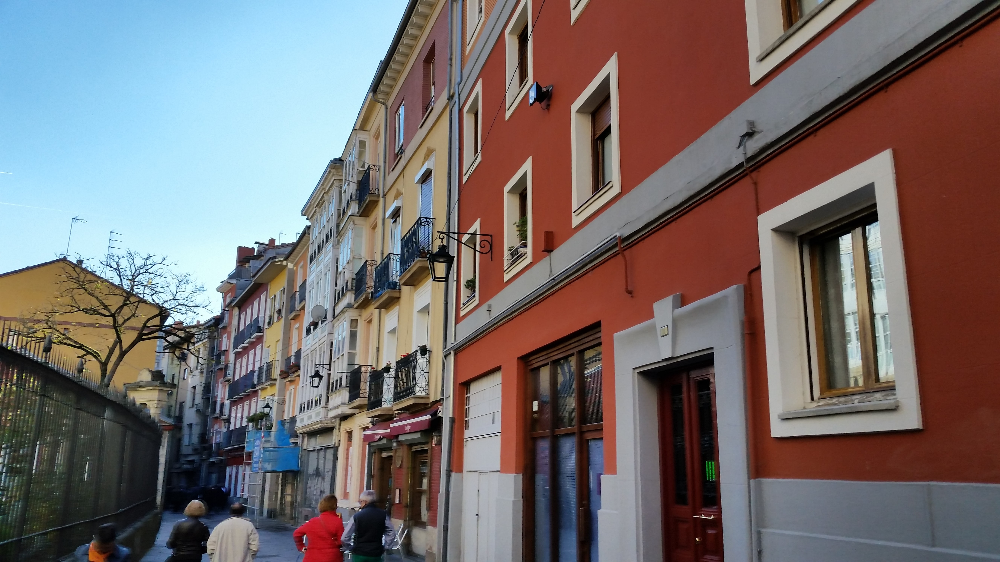  
  
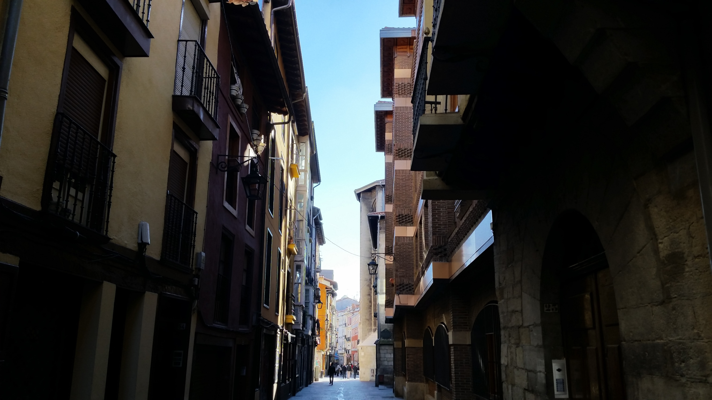  
  
We also went to the Cathedral de Santa María. There was hardly anyone inside and so we were basically alone.  
  

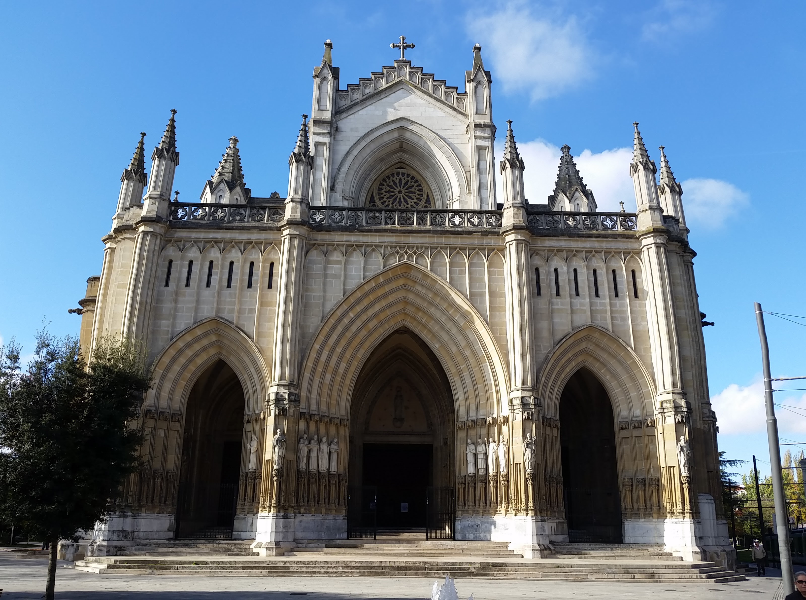

  

I think my favorite part of this cathedral was the stained glass.  I think it might have been the time of day, but the stained glass was so impressive, I think it was the most impressive I have seen.  I just wish I could have captured that moment.  I just couldn't find an angle that would work with my camera.

  

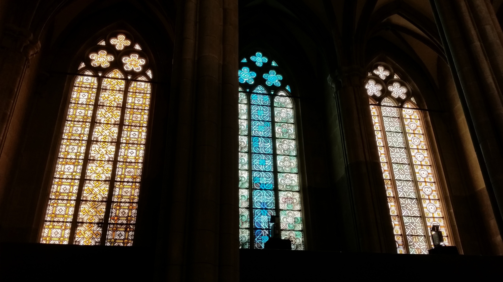

  

In a way though, that kind of is a good thing, because no matter how many pictures you take, you never can capture anything perfectly and no one will fully understand that moment unless they were there.  Sorry about that mini rant right there,  I promise I won't try to be philosophical again.

  

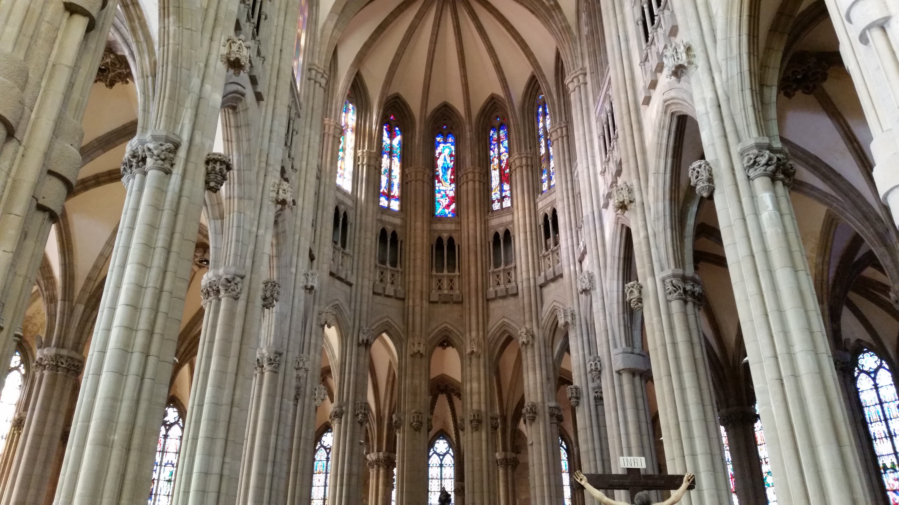

  

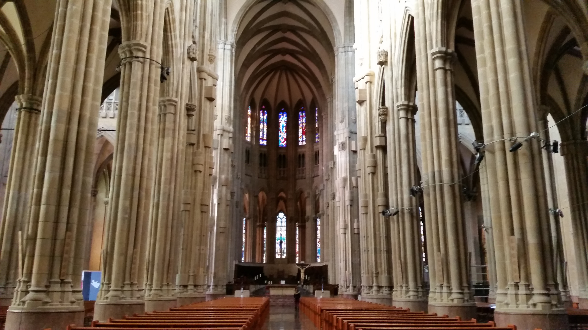

  

[Cathedral de Santa María](https://goo.gl/maps/Ddqtd3oF2fM2)

  

  

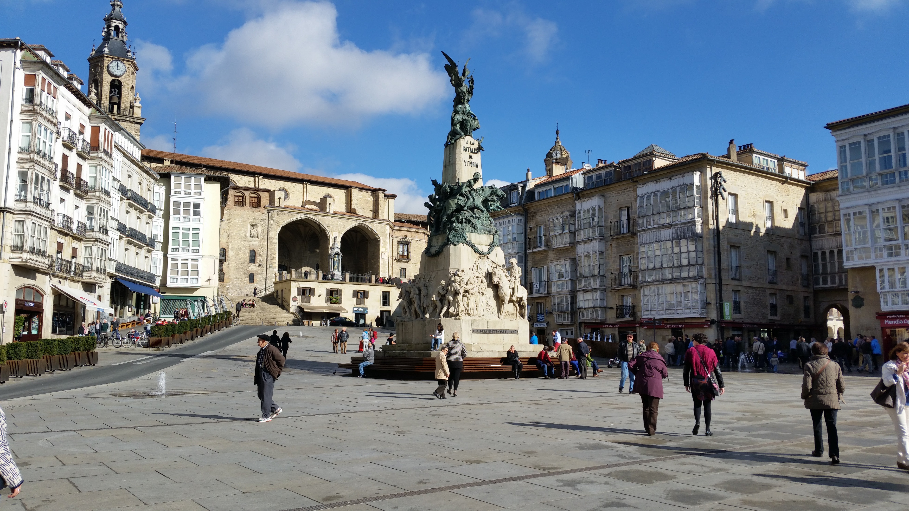

  

I don't know anything about these full building murals, but we did find a couple of them scattered around the city.

  

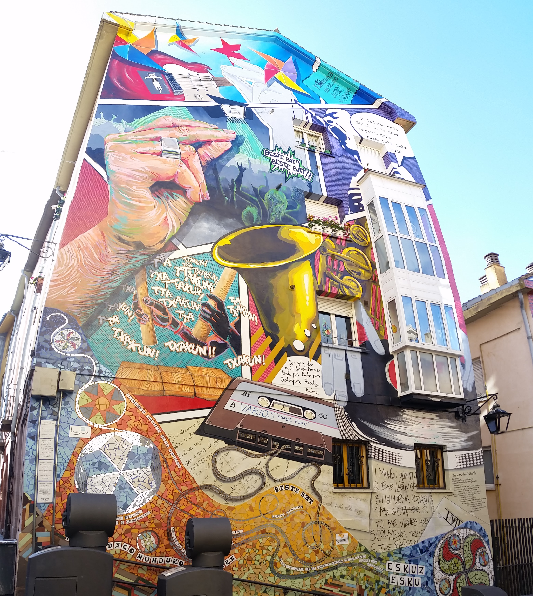

  

While we were walking around, we found a little museum.  It was only 1 Euro to enter and the guy working there was really nice.  He explained all of the different exhibits to us and talked to us for quite a while about some of the things they had there.

  

This fossil was 4 tall!

  

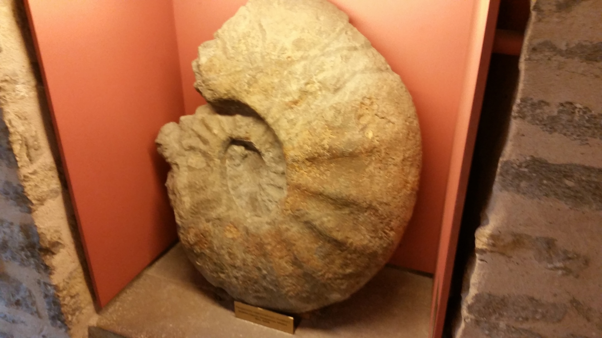

  

And these perfect cubes are actually minerals.

  

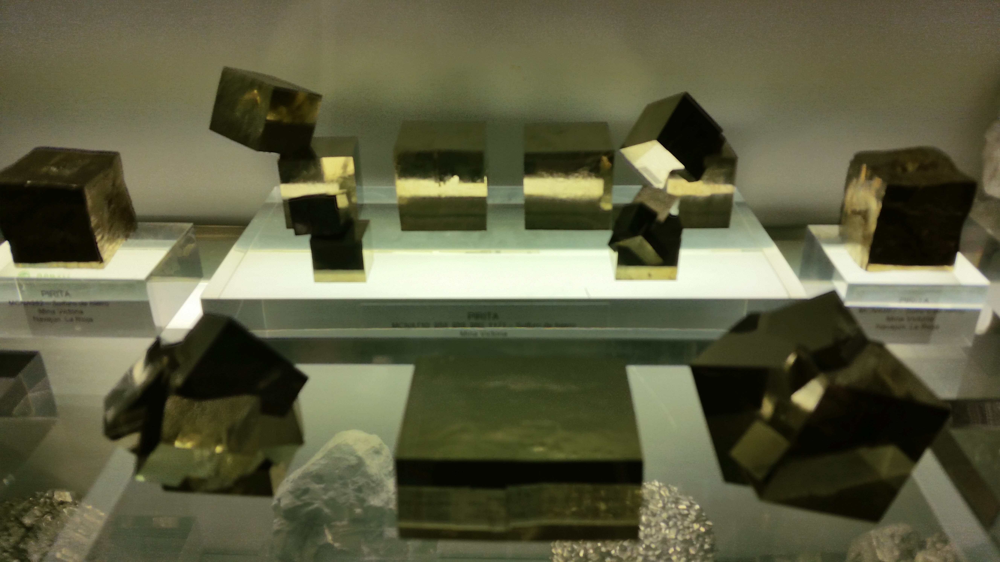

  

and so are these super long spike things!

  

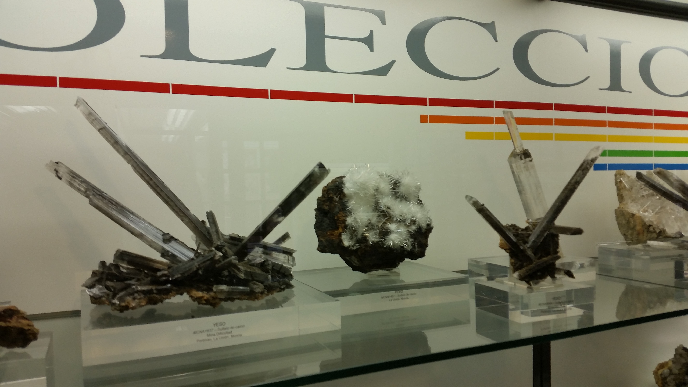

  

Okay so when we stopped for gelato, this family all rolled up on their scooters.  It was pretty funny to see a full grown man riding a scooter.  But it was even funnier that he had an adult sized scooter. 

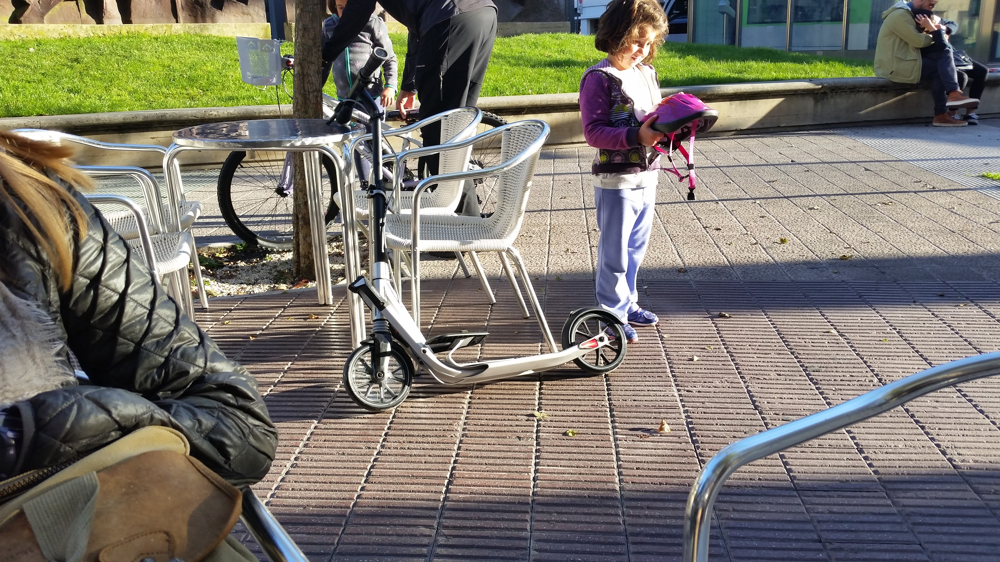

  

BUTTTT the funniest part was that on the dad's scooter there was a little black platform for his daughter to stand on while he was riding around. 

  

  

  
Sunday was a lazy day, I hung around the house, did some homework, talked with my family on Skype and hung out with Begoña.  
  
Like I said, even though I didn´t go anywhere big, this week was still pretty eventful!